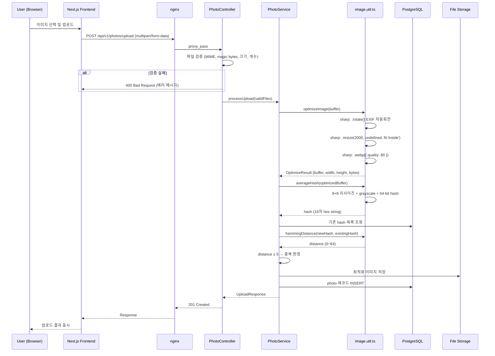

# Design Document: PhotoLite

## Overview

PhotoLite는 사진 최적화 및 정리 웹 서비스로, 사용자가 업로드한 사진을 자동으로 WebP 변환/리사이즈하여 용량을 최적화하고, aHash 기반 perceptual hashing으로 중복 사진을 감지하며, 갤러리와 절약 통계를 제공한다.

**핵심 기술 결정:**
- 이미지 처리: `sharp` 라이브러리 (EXIF 자동회전, 최대 너비 2000px 리사이즈, WebP quality 80)
- 중복 감지: aHash (Average Hash, 64-bit) + Hamming Distance ≤ 5 (중복 판정)
- 아키텍처: 3-tier (Frontend → Backend API → Database)
- 배포: EC2(m.large) 1대, Docker Compose, nginx reverse proxy
- 보안: helmet, CORS, @nestjs/throttler, class-validator

**포트 구성:**
- Backend: 3001 (환경변수 PORT로 설정 가능)
- Frontend: 3000

## Architecture

### 고수준 아키텍처 다이어그램 (3-Tier)

```mermaid
graph TB
    subgraph "Client Tier"
        FE[Next.js + shadcn/ui<br/>frontend/ :3000]
    end

    subgraph "Application Tier"
        NGINX[nginx reverse proxy]
        BE[NestJS Backend<br/>backend/ :3001]
        subgraph "Security Layer"
            HLM[helmet]
            CORS[CORS origin:3000]
            THR[@nestjs/throttler]
            VP[ValidationPipe]
        end
        subgraph "modules/photo"
            PC[PhotoController]
            PS[PhotoService]
            IU[image.util.ts<br/>순수 함수]
            CONST[photo.constants.ts]
        end
    end

    subgraph "Data Tier"
        DB[(PostgreSQL)]
        FS[File Storage<br/>/uploads]
    end

    FE -->|HTTP/REST| NGINX
    NGINX -->|proxy_pass| BE
    HLM --> BE
    CORS --> BE
    THR --> BE
    VP --> BE
    PC --> PS
    PS --> IU
    IU -->|sharp| FS
    PS -->|aHash 비교| DB
    PS -->|CRUD| DB
```

### 보안 아키텍처

| 계층 | 기술 | 설정 |
|------|------|------|
| HTTP 헤더 보안 | `helmet` | 기본 설정 (CSP, XSS, HSTS 등) |
| CORS | NestJS enableCors | `origin: ['http://localhost:3000']`, `credentials: true` |
| Rate Limiting | `@nestjs/throttler` | TTL/LIMIT 환경변수로 설정 (기본 60초/100요청) |
| DTO 검증 | `class-validator` + `class-transformer` | `whitelist: true`, `forbidNonWhitelisted: true`, `transform: true` |
| API 접두사 | NestJS setGlobalPrefix | `'api'` |

### 업로드 시퀀스 다이어그램



## Components and Interfaces

### 모듈 구조: `backend/src/modules/photo/`

```
backend/src/modules/photo/
├── photo.module.ts           # NestJS 모듈 정의
├── photo.controller.ts       # REST API 엔드포인트
├── photo.service.ts          # 비즈니스 로직 오케스트레이션
├── image.util.ts             # 핵심 유틸리티 (순수 함수: optimizeImage, averageHash, hammingDistance)
├── photo.constants.ts        # 모든 상수 정의 (매직넘버 추출)
├── dto/
│   ├── upload-photo.dto.ts   # 업로드 요청 DTO
│   ├── gallery-query.dto.ts  # 갤러리 조회 쿼리 DTO
│   └── photo-response.dto.ts # 응답 DTO
├── entities/
│   └── photo.entity.ts       # TypeORM 엔티티
└── interfaces/
    ├── optimization-result.interface.ts  # OptimizationResult
    ├── duplicate-result.interface.ts     # DuplicateResult
    └── index.ts                          # barrel export
```

### 상수 정의 (`photo.constants.ts`)

```typescript
/** 중복 판정 Hamming Distance 임계값 (이하이면 중복) */
export const DUPLICATE_HAMMING_THRESHOLD = 5;

/** 이미지 리사이즈 최대 너비 (px) */
export const MAX_WIDTH = 2000;

/** WebP 변환 품질 (0~100) */
export const WEBP_QUALITY = 80;

/** 단일 파일 최대 크기 (bytes, 15MB) */
export const MAX_FILE_SIZE = 15_728_640;

/** 한 요청당 최대 파일 개수 */
export const MAX_FILES_PER_REQUEST = 10;

/** 갤러리 기본 페이지 크기 */
export const DEFAULT_PAGE_SIZE = 20;

/** 갤러리 최대 페이지 크기 */
export const MAX_PAGE_SIZE = 100;
```

### 주요 인터페이스

```typescript
// image.util.ts의 optimizeImage 반환 타입
export interface OptimizeResult {
  buffer: Buffer;       // 최적화된 이미지 버퍼
  width: number;        // 최적화 후 너비 (px)
  height: number;       // 최적화 후 높이 (px)
  bytes: number;        // 최적화 후 파일 크기 (bytes)
  format: 'webp';       // 출력 포맷
}

// interfaces/optimization-result.interface.ts
export interface OptimizationResult {
  buffer: Buffer;
  width: number;
  height: number;
  bytes: number;
  format: 'webp';
  skipped: boolean;     // 원본이 더 작은 경우 true
}

// interfaces/duplicate-result.interface.ts
export interface DuplicateResult {
  isDuplicate: boolean;
  hash: string;         // 64-bit aHash (16자 hex string)
  similarImages: Array<{
    id: string;
    similarityScore: number; // 0.0 ~ 1.0
  }>;
  status: 'completed' | 'skipped' | 'timeout';
}

// 통계 API 응답 (GET /api/v1/photos/stats)
interface StatsResponse {
  count: number;
  totalOriginalBytes: number;
  totalOptimizedBytes: number;
  savedBytes: number;
  savedPercent: number;
}

// 갤러리 페이지네이션 응답
interface PaginatedGalleryResponse {
  images: PhotoResponse[];
  pagination: {
    totalCount: number;
    currentPage: number;
    totalPages: number;
    pageSize: number;
  };
}
```

### API 엔드포인트

| Method | Path | 설명 |
|--------|------|------|
| POST | `/api/v1/photos/upload` | 이미지 업로드 (multipart/form-data, 최대 10개) |
| GET | `/api/v1/photos` | 갤러리 조회 (페이지네이션) |
| GET | `/api/v1/photos/stats` | 절약 통계 조회 |
| GET | `/api/v1/photos/:id` | 개별 이미지 상세 조회 |
| DELETE | `/api/v1/photos/:id` | 이미지 삭제 |

### image.util.ts — 핵심 유틸리티 (순수 함수)

`image.util.ts`는 NestJS 서비스가 아닌 **순수 함수 모듈**로 구현되었다. DI 없이 직접 import하여 사용한다.

```typescript
import sharp from 'sharp';
import { MAX_WIDTH, WEBP_QUALITY } from './photo.constants';

/**
 * 이미지 최적화
 * - .rotate(): EXIF 자동회전
 * - .resize(MAX_WIDTH, undefined, { fit: 'inside', withoutEnlargement: true })
 *   → 너비만 2000px 제한, 높이는 비율에 따라 자동 결정
 * - .webp({ quality: 80 })
 */
export async function optimizeImage(buffer: Buffer): Promise<OptimizeResult>;

/**
 * Average Hash (aHash) - 64-bit perceptual hash 생성
 * 1. 8×8 리사이즈, grayscale 변환
 * 2. 64개 픽셀의 평균 밝기 계산
 * 3. 각 픽셀 >= 평균이면 1, 아니면 0 → 64-bit hash
 * 4. 16자 hex string으로 반환
 */
export async function averageHash(buffer: Buffer): Promise<string>;

/**
 * 두 hex hash 간 Hamming Distance 계산
 * @returns 다른 비트 수 (0~64)
 */
export function hammingDistance(hash1: string, hash2: string): number;
```

### aHash (Average Hash) 알고리즘 상세

aHash는 64-bit perceptual hash로, 이미지의 시각적 유사성을 빠르게 비교하기 위해 사용된다.

**알고리즘 단계:**
1. **리사이즈**: 이미지를 8×8 픽셀로 축소 (총 64 픽셀)
2. **그레이스케일 변환**: 컬러를 그레이스케일로 변환
3. **평균값 계산**: 64개 픽셀의 평균 밝기 계산
4. **비트 생성**: 각 픽셀이 평균보다 밝으면 1, 아니면 0 → 64-bit hash

**중복 판정 기준:**
- Hamming Distance: 두 해시 간 다른 비트 수 (0~64)
- **Threshold: DUPLICATE_HAMMING_THRESHOLD = 5**
- distance ≤ 5 → 중복 (similarity ≥ 0.921875 = 1 - 5/64)
- distance > 5 → unique

```typescript
// aHash 생성 (실제 구현)
export async function averageHash(buffer: Buffer): Promise<string> {
  const pixels = await sharp(buffer)
    .resize(8, 8, { fit: 'fill' })
    .grayscale()
    .raw()
    .toBuffer();

  let sum = 0;
  for (let i = 0; i < 64; i++) {
    sum += pixels[i];
  }
  const avg = sum / 64;

  let hash = BigInt(0);
  for (let i = 0; i < 64; i++) {
    if (pixels[i] >= avg) {
      hash |= BigInt(1) << BigInt(63 - i);
    }
  }

  return hash.toString(16).padStart(16, '0');
}

// Hamming Distance 계산 (실제 구현)
export function hammingDistance(hash1: string, hash2: string): number {
  const h1 = BigInt('0x' + hash1);
  const h2 = BigInt('0x' + hash2);
  let xor = h1 ^ h2;
  let distance = 0;

  while (xor > 0n) {
    distance += Number(xor & 1n);
    xor >>= 1n;
  }

  return distance;
}

// 중복 판정 (서비스에서 사용)
// hammingDistance(hash1, hash2) <= DUPLICATE_HAMMING_THRESHOLD → isDuplicate = true
```

### Sharp 최적화 엔진 상세 (실제 구현)

```typescript
import sharp from 'sharp';
import { MAX_WIDTH, WEBP_QUALITY } from './photo.constants';

export async function optimizeImage(buffer: Buffer): Promise<OptimizeResult> {
  const optimizedBuffer = await sharp(buffer)
    .rotate()                    // EXIF 자동회전
    .resize(MAX_WIDTH, undefined, {  // 너비만 2000px 제한, 높이는 undefined (비율 유지)
      fit: 'inside',
      withoutEnlargement: true,
    })
    .webp({ quality: WEBP_QUALITY }) // WebP quality 80
    .toBuffer();

  const metadata = await sharp(optimizedBuffer).metadata();

  return {
    buffer: optimizedBuffer,
    width: metadata.width!,
    height: metadata.height!,
    bytes: optimizedBuffer.length,
    format: 'webp',
  };
}
```

**설계 결정 사항:**
- 높이(height)에 대한 별도 제한 없음 — `resize(2000, undefined)`로 너비만 제한
- `fit: 'inside'` + `withoutEnlargement: true` → 원본이 2000px 이하면 확대 없이 유지
- `.rotate()` → EXIF orientation 정보에 따라 자동 회전 (모바일 사진 대응)
- 원본 보존(skipped) 로직은 `OptimizationResult` 인터페이스에 정의되어 있으나, `optimizeImage()` 함수 자체는 항상 WebP 변환 수행

## Data Models

### Photo 테이블

| 컬럼 | 타입 | 제약조건 | 설명 |
|------|------|---------|------|
| id | UUID | PK, DEFAULT gen_random_uuid() | 고유 식별자 |
| fileName | VARCHAR(255) | NOT NULL | 원본 파일명 |
| hash | CHAR(16) | NOT NULL, INDEX | aHash (64-bit, 16자 hex) |
| originalBytes | INTEGER | NOT NULL | 원본 파일 크기 (bytes) |
| optimizedBytes | INTEGER | NOT NULL | 최적화 후 파일 크기 (bytes) |
| width | INTEGER | NOT NULL | 최적화 이미지 너비 (px) |
| height | INTEGER | NOT NULL | 최적화 이미지 높이 (px) |
| createdAt | TIMESTAMP | NOT NULL, DEFAULT NOW() | 업로드 시간 |

### TypeORM Entity 정의 (실제 구현)

```typescript
@Entity('photo')
@Index('idx_photo_created_at', ['createdAt'])
export class Photo {
  @PrimaryGeneratedColumn('uuid')
  id: string;

  @Column({ type: 'varchar', length: 255 })
  fileName: string;

  @Column({ type: 'char', length: 16 })
  @Index('idx_photo_hash')
  hash: string;

  @Column({ type: 'integer' })
  originalBytes: number;

  @Column({ type: 'integer' })
  optimizedBytes: number;

  @Column({ type: 'integer' })
  width: number;

  @Column({ type: 'integer' })
  height: number;

  @CreateDateColumn({ type: 'timestamp' })
  createdAt: Date;
}
```

### DDL

```sql
CREATE TABLE photo (
  id UUID PRIMARY KEY DEFAULT gen_random_uuid(),
  "fileName" VARCHAR(255) NOT NULL,
  hash CHAR(16) NOT NULL,
  "originalBytes" INTEGER NOT NULL,
  "optimizedBytes" INTEGER NOT NULL,
  width INTEGER NOT NULL,
  height INTEGER NOT NULL,
  "createdAt" TIMESTAMP NOT NULL DEFAULT NOW()
);

CREATE INDEX idx_photo_hash ON photo (hash);
CREATE INDEX idx_photo_created_at ON photo ("createdAt" DESC);
```


## Correctness Properties

*A property is a characteristic or behavior that should hold true across all valid executions of a system—essentially, a formal statement about what the system should do. Properties serve as the bridge between human-readable specifications and machine-verifiable correctness guarantees.*

### Property 1: 파일 타입 검증 일관성

*For any* 파일 업로드 요청에 포함된 파일에 대해, 해당 파일의 MIME 타입이 image/jpeg, image/png, image/webp 중 하나이면 수락되고, 그 외의 MIME 타입이면 거부되어야 한다. 이 규칙은 배치 업로드(최대 10개)에서도 각 파일에 독립적으로 적용되어야 한다.

**Validates: Requirements 1.1, 1.3, 1.4**

### Property 2: 파일 크기 제한

*For any* 업로드 파일에 대해, 파일 크기가 15,728,640 bytes (15MB)를 초과하면 거부되어야 하고, 이하이면 크기 검증을 통과해야 한다.

**Validates: Requirements 1.2**

### Property 3: Magic bytes 무결성 검증

*For any* 업로드 파일에 대해, magic bytes를 파싱하여 얻은 실제 콘텐츠 타입이 지원되는 이미지 포맷(JPEG, PNG, WebP)과 일치하면 수락되고, 일치하지 않으면 거부되어야 한다. MIME 헤더와 무관하게 실제 파일 내용 기반으로 판단한다.

**Validates: Requirements 1.5**

### Property 4: 이미지 최적화 불변식

*For any* 유효한 이미지 파일(JPEG, PNG, WebP)에 대해, `optimizeImage()` 처리 후 출력은 (1) WebP 포맷이어야 하고, (2) 너비가 2000px(MAX_WIDTH) 이하여야 하며, (3) 원본 이미지의 가로세로 비율(aspect ratio)이 보존되어야 한다 (반올림 오차 ±1px 허용). 높이에 대한 별도 상한은 없으며, 너비 기준 `fit: 'inside'`로 비율이 결정된다.

**Validates: Requirements 2.1, 2.3**

### Property 5: 원본 메타데이터 보존

*For any* 최적화 처리된 이미지에 대해, 저장된 레코드의 originalBytes는 원본 파일 크기와 동일해야 하고, optimizedBytes는 실제 최적화된 파일 크기와 동일해야 한다.

**Validates: Requirements 2.5**

### Property 6: 이미 최적 WebP 보존

*For any* WebP 포맷의 업로드 파일에 대해, quality 80으로 재인코딩한 결과가 원본보다 크거나 같으면, 출력은 원본 파일을 그대로 유지해야 한다 (바이트 크기가 동일).

**Validates: Requirements 2.6**

### Property 7: 중복 감지 threshold 분류

*For any* 두 이미지의 aHash 쌍에 대해, Hamming Distance가 DUPLICATE_HAMMING_THRESHOLD(5) 이하이면 duplicate로 분류되어야 하고, 5 초과이면 unique로 분류되어야 한다. 이는 similarity score로 환산하면 ≥ 0.921875 (= 1 - 5/64)에 해당한다. 반환되는 유사 이미지 목록은 최대 10개이며, similarity score 내림차순으로 정렬되어야 한다.

**Validates: Requirements 3.3, 3.4**

### Property 8: 갤러리 페이지네이션 정확성

*For any* N개의 이미지 레코드와 pageSize(기본 20, 최대 100) 및 page 번호에 대해, (1) 반환 결과는 createdAt 내림차순 정렬이어야 하고, (2) totalPages = ceil(N / pageSize)이어야 하며, (3) 각 페이지의 이미지 수는 pageSize 이하여야 하고, (4) pageSize 미지정 시 DEFAULT_PAGE_SIZE(20)이 적용되며 MAX_PAGE_SIZE(100) 초과 요청 시 100으로 제한되어야 한다.

**Validates: Requirements 4.1, 4.2, 4.3**

### Property 9: Savings percentage 계산 정확성

*For any* originalBytes > 0이고 optimizedBytes ≥ 0인 이미지에 대해, savings percentage는 ((originalBytes - optimizedBytes) / originalBytes) × 100으로 계산되며, 소수점 첫째 자리로 반올림되어야 한다.

**Validates: Requirements 4.6**

### Property 10: 통계 집계 정확성

*For any* photo 레코드 집합에 대해, `GET /api/v1/photos/stats` 응답은 (1) count = 레코드 수, (2) totalOriginalBytes = Σ(originalBytes), (3) totalOptimizedBytes = Σ(optimizedBytes), (4) savedBytes = totalOriginalBytes - totalOptimizedBytes, (5) savedPercent = (savedBytes / totalOriginalBytes) × 100. 레코드가 0개이면 모든 값은 0이어야 한다.

**Validates: Requirements 5.1, 5.2, 5.3, 5.4, 5.5, 5.6**

### Property 11: 파일명 독립성

*For any* 동일한 fileName을 가진 N개의 업로드 요청에 대해, 모든 요청이 독립적으로 저장되어야 하며 각각 고유한 UUID id를 가져야 한다.

**Validates: Requirements 6.5**

## Error Handling

### 에러 처리 전략

| 에러 유형 | HTTP 상태 | 응답 형식 | 복구 동작 |
|-----------|----------|-----------|-----------|
| 지원하지 않는 포맷 | 400 | `{ error: "UNSUPPORTED_FORMAT", message: "...", supportedFormats: [...] }` | - |
| 파일 크기 초과 | 400 | `{ error: "FILE_TOO_LARGE", message: "...", maxSize: 15728640 }` | - |
| 빈 파일 | 400 | `{ error: "EMPTY_FILE", message: "..." }` | - |
| 파일 개수 초과 | 400 | `{ error: "TOO_MANY_FILES", message: "...", maxFiles: 10 }` | - |
| Magic bytes 불일치 | 400 | `{ error: "INVALID_CONTENT", message: "..." }` | - |
| 손상된 이미지 | 422 | `{ error: "CORRUPTED_FILE", message: "..." }` | 임시 파일 삭제 |
| DB 연결 실패 | 503 | `{ error: "SERVICE_UNAVAILABLE", message: "..." }` | 부분 데이터 삭제, 임시 파일 삭제 |
| 스토리지 부족 | 503 | `{ error: "INSUFFICIENT_STORAGE", message: "..." }` | 업로드 거부 |
| OOM | 503 | `{ error: "PROCESSING_FAILED", message: "..." }` | 할당 메모리 해제 |
| Rate Limit 초과 | 429 | `{ error: "TOO_MANY_REQUESTS", message: "..." }` | @nestjs/throttler 자동 처리 |
| 중복 감지 타임아웃 | - (업로드 계속) | 응답에 `duplicateStatus: "deferred"` 포함 | 10분 내 비동기 처리 |
| 해시 생성 실패 | - (업로드 계속) | 응답에 `duplicateStatus: "skipped"` 포함 | 중복 마킹 없이 저장 |

### 임시 파일 정리 정책

- 모든 에러 발생 시 60초 이내에 해당 업로드의 임시 파일 삭제
- 네트워크 중단 감지 시 30초 이내에 불완전 데이터 삭제
- 주기적 클린업 크론잡으로 고아 임시 파일 제거 (매 5분)

### 에러 응답 공통 구조

```typescript
interface ErrorResponse {
  error: string;       // 에러 코드 (대문자 스네이크케이스)
  message: string;     // 사용자 친화적 메시지
  details?: Record<string, any>; // 추가 정보 (선택)
  timestamp: string;   // ISO 8601
}
```

## Testing Strategy

### 이중 테스트 접근법

**1. Property-Based Tests (fast-check)**

- 라이브러리: `fast-check` (TypeScript/JavaScript PBT 라이브러리)
- 최소 100회 반복 실행
- 각 테스트에 설계 문서 Property 참조 태그 포함

| Property | 테스트 대상 | Generator 전략 |
|----------|------------|----------------|
| Property 1 | Upload 검증 | 랜덤 MIME 타입 + 파일 데이터 |
| Property 2 | 크기 제한 | 랜덤 바이트 크기 (0 ~ 20MB) |
| Property 3 | Magic bytes | 랜덤 바이트 배열 (유효/무효 magic bytes) |
| Property 4 | 최적화 불변식 (2000px 너비 제한) | 랜덤 크기/포맷 이미지 생성 (sharp로 생성) |
| Property 5 | 메타데이터 보존 | 랜덤 이미지 → 처리 → 저장 메타데이터 비교 |
| Property 6 | WebP 보존 | 작은 WebP 파일 생성 |
| Property 7 | 중복 감지 (hamming distance ≤ 5) | 랜덤 64-bit 해시 쌍 생성 |
| Property 8 | 페이지네이션 | 랜덤 레코드 수 + pageSize + page |
| Property 9 | Savings % | 랜덤 originalBytes/optimizedBytes 쌍 |
| Property 10 | 통계 집계 (stats endpoint) | 랜덤 photo 레코드 배열 |
| Property 11 | 파일명 독립 | 동일 fileName으로 랜덤 횟수 생성 |

**태그 형식:**
```typescript
// Feature: photo-lite, Property 4: 이미지 최적화 불변식
// Feature: photo-lite, Property 7: 중복 감지 threshold 분류
```

**2. Unit Tests (Jest)**

- 특정 예시 검증 (정상 JPEG 업로드 → 성공)
- 엣지 케이스 (0 bytes 파일, 10개 초과 배치, 범위 외 페이지)
- 에러 조건 (손상 파일, DB 실패)
- `image.util.ts` 순수 함수 직접 테스트

**3. Integration Tests**

- 전체 업로드 플로우 (파일 → 최적화 → 해시 → 저장)
- DB 연동 갤러리 조회
- 통계 API 정확성 (`GET /api/v1/photos/stats`)
- 성능 벤치마크 (5초 이내 처리, 2초 이내 통계)
- 보안 헤더 검증 (helmet, CORS, throttler)

### 테스트 구조

```
backend/src/modules/photo/
├── __tests__/
│   ├── photo.controller.spec.ts      # API 엔드포인트 단위 테스트
│   ├── photo.service.spec.ts         # 서비스 로직 단위 테스트
│   ├── image.util.spec.ts            # image.util.ts 순수 함수 테스트
│   ├── properties/
│   │   ├── upload-validation.prop.ts # Property 1, 2, 3
│   │   ├── optimization.prop.ts      # Property 4, 5, 6
│   │   ├── duplicate.prop.ts         # Property 7
│   │   ├── gallery.prop.ts           # Property 8, 9
│   │   └── statistics.prop.ts        # Property 10, 11
│   └── integration/
│       ├── upload-flow.e2e.ts        # 전체 업로드 플로우
│       └── performance.bench.ts      # 성능 벤치마크
```

### Property Test 설정 예시

```typescript
import fc from 'fast-check';
import { hammingDistance } from '../image.util';
import { DUPLICATE_HAMMING_THRESHOLD } from '../photo.constants';

// Feature: photo-lite, Property 7: 중복 감지 threshold 분류
describe('Duplicate Detection Properties', () => {
  it('should classify based on hamming distance threshold (≤5 = duplicate)', () => {
    fc.assert(
      fc.property(
        fc.hexaString({ minLength: 16, maxLength: 16 }), // hash1
        fc.hexaString({ minLength: 16, maxLength: 16 }), // hash2
        (hash1, hash2) => {
          const distance = hammingDistance(hash1, hash2);
          const isDuplicate = distance <= DUPLICATE_HAMMING_THRESHOLD;
          
          if (distance <= 5) {
            expect(isDuplicate).toBe(true);
          } else {
            expect(isDuplicate).toBe(false);
          }
        }
      ),
      { numRuns: 100 }
    );
  });
});
```
