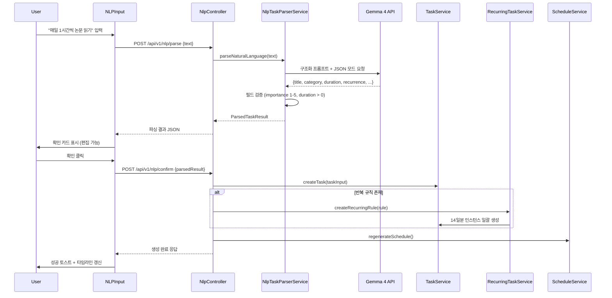
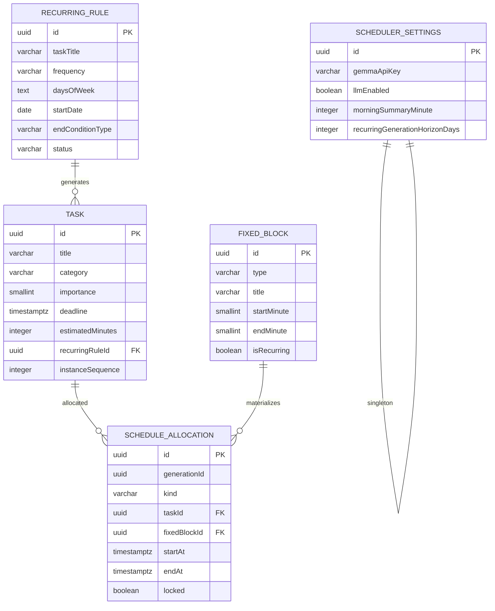
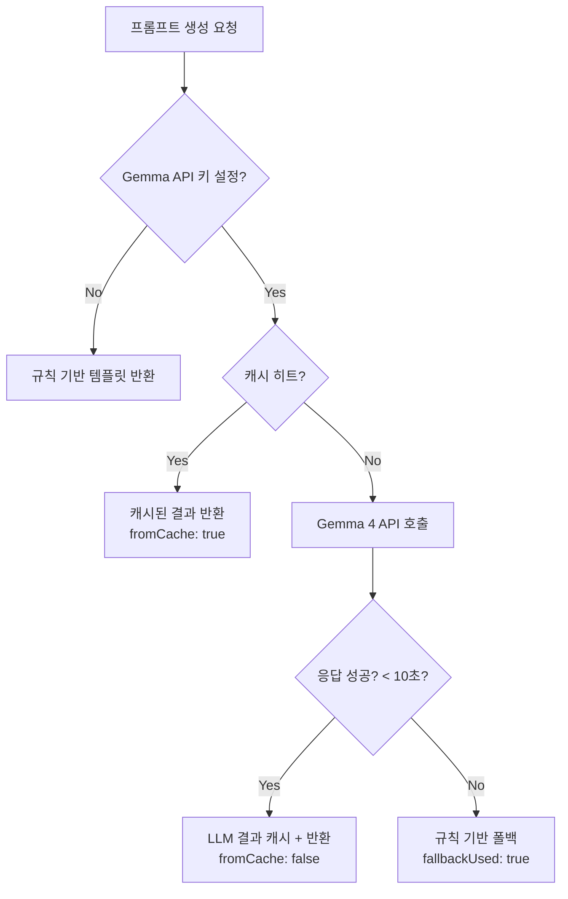
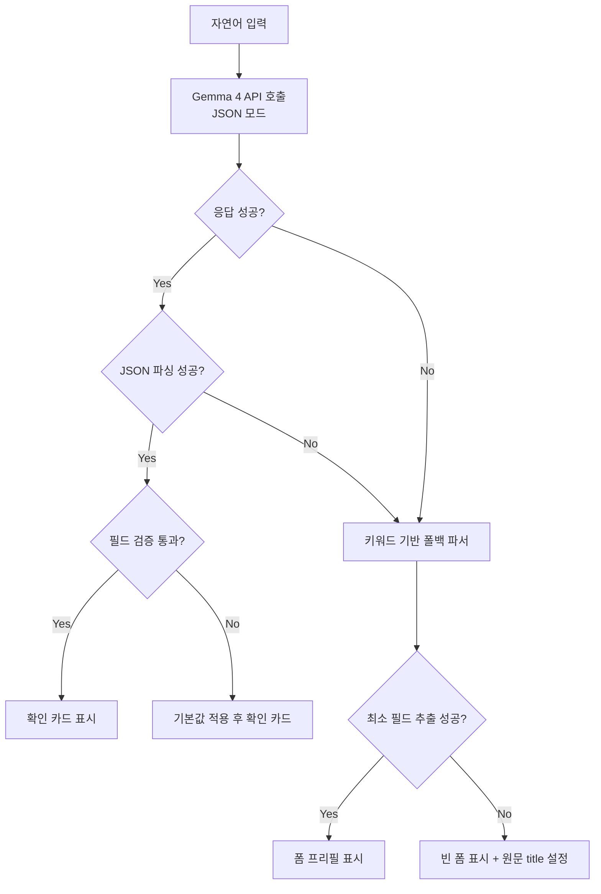

# Design Document: SmartScheduler Upgrade

## Overview

SmartScheduler Upgrade는 기존 PhotoLite SmartScheduler를 5가지 핵심 영역에서 확장하는 기능 업그레이드이다. 기존 시스템의 아키텍처(NestJS + TypeORM + PostgreSQL 백엔드, Next.js 15 + TailwindCSS 프론트엔드)를 유지하면서 다음 기능을 추가한다:

1. **UI/UX 개선** — 드래그 앤 드롭 일정 조정(HTML5 DnD API), 주간/월간 캘린더 뷰(TailwindCSS Grid 커스텀), 다크 모드(TailwindCSS `darkMode: 'class'`)
2. **알림/리마인더** — 마감 임박 Browser Notifications + 매일 아침 일정 요약
3. **통계/분석** — SQL 기반 주간/월간 시간 사용 집계, 카테고리별 투자 시간 리포트 + 주 단위 트렌드
4. **AI 강화** — Google AI Studio REST API (Gemma 4 모델) 연동으로 LLM 기반 프롬프트 생성 + 자연어 태스크 파싱
5. **반복 태스크** — RecurringRule 엔티티 + 독립 인스턴스 자동 생성

**핵심 기술 결정:**

| 영역 | 결정 | 근거 |
|------|------|------|
| Gemma 4 API | Google AI Studio REST (`generativelanguage.googleapis.com`), 모델 `gemma-3-27b-it` (무료 티어) | 무료, 한국어 지원, JSON 모드로 구조화 출력 가능 |
| NLP 파싱 | 단일 API 호출 + structured JSON output | 한 번의 호출로 모든 필드 추출, 지연 최소화 |
| 드래그 앤 드롭 | HTML5 Drag and Drop API (외부 라이브러리 없음) | 번들 사이즈 절약, 타임라인·캘린더 모두 지원 |
| 캘린더 뷰 | TailwindCSS Grid 커스텀 구현 | 외부 라이브러리 불필요, 기존 디자인 시스템과 일관성 |
| 다크 모드 | TailwindCSS `darkMode: 'class'` + localStorage | Next.js SSR flash 방지, 기존 Tailwind 파이프라인 재사용 |
| 알림 | Browser Notifications API + setInterval 폴링 (5분) | 서버리스, 프론트엔드 전용, 간단한 구현 |
| 통계 | TypeORM QueryBuilder SQL 집계 (schedule_allocation JOIN task) | 기존 인프라 활용, 추가 서비스 불필요 |
| 반복 태스크 | RecurringRule 엔티티 + 14일 선행 생성 | 기존 Task 엔티티 재사용, 스케줄링 엔진 변경 최소화 |
| NLP 입력 UI | 태스크 관리 탭 상단 chat-style input box | 기존 탭 구조에 자연스럽게 통합 |

## Architecture

### 전체 시스템 아키텍처 (업그레이드 후)

```mermaid
graph TB
    subgraph "Client Tier — Next.js :3000"
        FE_P[갤러리/통계<br/>PhotoLite 페이지]
        subgraph "/schedule 페이지"
            TABS[ScheduleTabs]
            TL[TimelineView + DnD]
            CAL[CalendarView<br/>주간/월간]
            TM[ThemeToggle<br/>다크모드]
            NLP_UI[NLPInput<br/>자연어 입력]
            NOTI[NotificationService<br/>Browser Notifications]
            ANALYTICS_UI[AnalyticsView<br/>차트/리포트]
        end
    end

    subgraph "Application Tier — NestJS :3001"
        NGINX[nginx reverse proxy]
        subgraph "modules/scheduler (확장)"
            TC[TaskController]
            FBC[FixedBlockController]
            SC[ScheduleController]
            STC[SettingsController]
            AC[AnalyticsController ★신규]
            RC[RecurringController ★신규]
            NPC[NlpController ★신규]
            TS[TaskService]
            FBS[FixedBlockService]
            SCHS[ScheduleService]
            TMS[TimeService]
            AIR[AiRecommenderService]
            LLM[LlmRecommenderService ★신규]
            AS[AnalyticsService ★신규]
            RTS[RecurringTaskService ★신규]
            NLPS[NlpTaskParserService ★신규]
            subgraph "순수 함수 (util)"
                PU[priority.util.ts]
                SU[scheduling.util.ts]
                AU[ai-recommender.util.ts]
                NLPU[nlp-parser.util.ts ★신규]
                ANAU[analytics.util.ts ★신규]
            end
        end
    end

    subgraph "Data Tier"
        DB[(PostgreSQL<br/>task, fixed_block,<br/>schedule_allocation,<br/>scheduler_settings,<br/>recurring_rule ★신규)]
    end

    subgraph "External"
        GEMMA[Google AI Studio<br/>Gemma 4 API]
    end

    TL -->|PATCH /allocations/:id| NGINX
    CAL -->|GET /schedule| NGINX
    ANALYTICS_UI -->|GET /analytics/*| NGINX
    NLP_UI -->|POST /nlp/parse| NGINX
    NOTI -->|GET /schedule, /tasks| NGINX
    NGINX --> AC & RC & NPC
    NGINX --> TC & FBC & SC & STC
    LLM -->|HTTP| GEMMA
    NLPS -->|HTTP| GEMMA
    AC --> AS
    RC --> RTS
    NPC --> NLPS
    NLPS --> TS
    NLPS --> RTS
    RTS --> TS
    AS --> DB
    RTS --> DB
    NLPS --> LLM

### 드래그 앤 드롭 시퀀스 다이어그램

```mermaid
sequenceDiagram
    participant U as User
    participant DnD as DragDrop_Controller
    participant FE as Scheduler_Frontend
    participant API as ScheduleController
    participant DB as PostgreSQL

    U->>DnD: dragstart (unlocked TASK block)
    DnD->>DnD: ghostElement 생성, 원본 opacity 감소
    U->>DnD: dragover (시간 슬롯)
    DnD->>DnD: 실시간 시간 미리보기 표시
    U->>DnD: drop (대상 슬롯)
    DnD->>DnD: 충돌 검사 (고정블록/잠금블록 겹침?)
    alt 충돌 발생
        DnD->>FE: 원래 위치 복원 + 에러 토스트
    else 충돌 없음
        DnD->>API: PATCH /schedule/allocations/:id {startAt, endAt}
        API->>DB: UPDATE schedule_allocation SET startAt, endAt, locked=true
        API-->>DnD: 200 OK
        DnD->>FE: 타임라인/캘린더 뷰 낙관적 업데이트
    end
```

### 자연어 태스크 생성 시퀀스 다이어그램



## Components and Interfaces

### 백엔드 신규/확장 모듈 구조

```
backend/src/modules/scheduler/
├── (기존 파일 유지)
├── analytics.controller.ts        ★ 신규: 통계 API 엔드포인트
├── analytics.service.ts           ★ 신규: 시간 집계 비즈니스 로직
├── analytics.util.ts              ★ 신규: 순수 함수 - 트렌드 계산, 완료율
├── recurring.controller.ts        ★ 신규: 반복 규칙 CRUD
├── recurring-task.service.ts      ★ 신규: 반복 인스턴스 생성/관리
├── llm-recommender.service.ts     ★ 신규: Gemma 4 API 연동
├── nlp.controller.ts              ★ 신규: 자연어 파싱 API
├── nlp-task-parser.service.ts     ★ 신규: NLP 파싱 오케스트레이션
├── nlp-parser.util.ts             ★ 신규: 순수 함수 - 키워드 추출 폴백
├── entities/
│   ├── (기존 엔티티 유지)
│   └── recurring-rule.entity.ts   ★ 신규
├── dto/
│   ├── (기존 DTO 유지)
│   ├── analytics-report.dto.ts    ★ 신규
│   ├── create-recurring-rule.dto.ts ★ 신규
│   ├── update-recurring-rule.dto.ts ★ 신규
│   ├── nlp-parse-request.dto.ts   ★ 신규
│   ├── nlp-parse-response.dto.ts  ★ 신규
│   ├── nlp-confirm-request.dto.ts ★ 신규
│   └── update-allocation.dto.ts   ★ 신규 (DnD 시간 변경용)
└── interfaces/
    ├── (기존 인터페이스 유지)
    ├── analytics.interface.ts     ★ 신규
    ├── recurring.interface.ts     ★ 신규
    └── nlp.interface.ts           ★ 신규
```

### 프론트엔드 신규/확장 컴포넌트

```
frontend/src/
├── components/scheduler/
│   ├── (기존 컴포넌트 유지)
│   ├── CalendarView.tsx           ★ 신규: 주간/월간 캘린더
│   ├── CalendarWeekView.tsx       ★ 신규: 주간 뷰 (시간별 그리드)
│   ├── CalendarMonthView.tsx      ★ 신규: 월간 뷰 (일별 요약)
│   ├── DragDropWrapper.tsx        ★ 신규: DnD 컨텍스트 래퍼
│   ├── DraggableBlock.tsx         ★ 신규: 드래그 가능 블록
│   ├── DropSlot.tsx               ★ 신규: 드롭 대상 슬롯
│   ├── ThemeToggle.tsx            ★ 신규: 다크모드 토글 버튼
│   ├── NLPInput.tsx               ★ 신규: 자연어 입력 + 확인 카드
│   ├── AnalyticsView.tsx          ★ 신규: 통계 대시보드
│   ├── AnalyticsBarChart.tsx      ★ 신규: 카테고리별 시간 바 차트
│   ├── RecurringTaskForm.tsx      ★ 신규: 반복 규칙 생성 폼
│   └── RecurringTaskList.tsx      ★ 신규: 반복 태스크 목록
├── hooks/
│   ├── (기존 훅 유지)
│   ├── useTheme.ts                ★ 신규: 다크모드 상태 관리
│   ├── useNotification.ts         ★ 신규: 알림 권한/발송
│   ├── useAnalytics.ts            ★ 신규: 통계 데이터 조회
│   ├── useRecurringTasks.ts       ★ 신규: 반복 규칙 CRUD
│   ├── useNlpParser.ts            ★ 신규: 자연어 파싱 API 호출
│   ├── useCalendar.ts             ★ 신규: 캘린더 날짜 네비게이션
│   └── useDragDrop.ts             ★ 신규: DnD 상태 관리
└── lib/
    ├── notification-scheduler.ts  ★ 신규: 폴링 기반 알림 스케줄러
    └── theme-service.ts           ★ 신규: localStorage 테마 관리
```

### 신규 API 엔드포인트

| Method | Path | 설명 |
|--------|------|------|
| PATCH | `/api/v1/schedule/allocations/:id` | DnD 시간 변경 (startAt, endAt 업데이트 + 자동 잠금) |
| GET | `/api/v1/analytics/weekly` | 주간 시간 사용 분석 리포트 |
| GET | `/api/v1/analytics/monthly` | 월간 시간 사용 분석 리포트 |
| GET | `/api/v1/analytics/categories?period=7\|30` | 카테고리별 상세 리포트 + 트렌드 |
| POST | `/api/v1/recurring-rules` | 반복 규칙 생성 |
| GET | `/api/v1/recurring-rules` | 반복 규칙 목록 |
| PATCH | `/api/v1/recurring-rules/:id` | 반복 규칙 수정 (미래 인스턴스 일괄 적용) |
| DELETE | `/api/v1/recurring-rules/:id` | 반복 규칙 삭제 (미래 PENDING 인스턴스 삭제) |
| GET | `/api/v1/recurring-rules/:id/instances` | 반복 규칙의 인스턴스 목록 |
| POST | `/api/v1/nlp/parse` | 자연어 텍스트 파싱 (Gemma 4 호출) |
| POST | `/api/v1/nlp/confirm` | 파싱 결과 확인 → 태스크/반복 규칙 생성 |

### 주요 인터페이스 (신규)

```typescript
// interfaces/analytics.interface.ts
export interface CategoryTimeReport {
  category: string;
  totalMinutes: number;
  tasksCompleted: number;
  tasksOverdue: number;
  avgCompletionMinutes: number;
  weekOverWeekChangePercent: number; // -100 ~ +∞
  dailyBreakdown: { dayOfWeek: number; minutes: number }[];
}

export interface WeeklyReport {
  period: { start: string; end: string };
  categoryBreakdown: { category: string; totalMinutes: number }[];
  completionRate: number; // 0.0 ~ 1.0
  dailyAverageMinutes: number;
  totalProductiveMinutes: number;
}

export interface MonthlyReport extends WeeklyReport {
  // 동일 구조, 기간만 30일
}

// interfaces/recurring.interface.ts
export type RecurrenceFrequency = 'DAILY' | 'WEEKLY';
export type EndConditionType = 'DATE' | 'COUNT' | 'NEVER';

export interface RecurringRuleInput {
  taskTitle: string;
  taskDescription?: string;
  taskCategory: string;
  importance: number;
  estimatedMinutes: number;
  frequency: RecurrenceFrequency;
  daysOfWeek?: number[]; // 0=일~6=토, WEEKLY 시 필수
  startDate: string; // YYYY-MM-DD
  endConditionType: EndConditionType;
  endDate?: string; // endConditionType === 'DATE'
  occurrences?: number; // endConditionType === 'COUNT'
  deadlineTimeOffset: number; // 분 (인스턴스 날짜 기준 마감 오프셋, 기본 1439 = 23:59)
}

export interface RecurringRuleResponse {
  id: string;
  taskTitle: string;
  taskCategory: string;
  frequency: RecurrenceFrequency;
  daysOfWeek?: number[];
  startDate: string;
  endConditionType: EndConditionType;
  endDate?: string;
  occurrences?: number;
  totalGenerated: number;
  status: 'ACTIVE' | 'EXPIRED';
  createdAt: string;
}

// interfaces/nlp.interface.ts
export interface NlpParseResult {
  title: string;
  category: string;
  importance: number;
  estimatedMinutes: number;
  deadline?: string; // ISO 8601
  earliestStart?: string;
  recurrence?: {
    frequency: RecurrenceFrequency;
    daysOfWeek?: number[];
    endConditionType: EndConditionType;
    endDate?: string;
    occurrences?: number;
  };
  confidence: number; // 0.0 ~ 1.0
  clarificationNeeded?: string; // 후속 질문
}

export interface NlpMultiParseResult {
  tasks: NlpParseResult[];
  rawText: string;
}
```

### LLM Recommender 서비스 설계

```typescript
// llm-recommender.service.ts 핵심 로직
@Injectable()
export class LlmRecommenderService {
  private readonly API_URL = 'https://generativelanguage.googleapis.com/v1beta/models/gemma-3-27b-it:generateContent';
  private readonly MAX_TOKENS = 500;
  private readonly TIMEOUT_MS = 10_000;
  private cache: Map<string, { prompt: string; timestamp: string }> = new Map();

  async generatePrompt(task: TaskWithDetails): Promise<LlmPromptResult> {
    const cacheKey = `${task.id}:${task.updatedAt}`;
    if (this.cache.has(cacheKey)) {
      return { ...this.cache.get(cacheKey)!, fromCache: true, model: 'gemma-3-27b-it' };
    }

    const apiKey = await this.settingsService.getGemmaApiKey();
    if (!apiKey) {
      return this.fallbackToRuleBased(task);
    }

    try {
      const response = await this.callGemmaApi(apiKey, task);
      const result = { prompt: response, fromCache: false, model: 'gemma-3-27b-it', timestamp: new Date().toISOString() };
      this.cache.set(cacheKey, result);
      return result;
    } catch (error) {
      return this.fallbackToRuleBased(task);
    }
  }
}
```

### NLP 파서 Gemma 4 프롬프트 설계

```typescript
// NLP 파싱용 시스템 프롬프트 (한국어 특화)
const NLP_SYSTEM_PROMPT = `당신은 한국어 태스크 관리 시스템의 자연어 파서입니다.
사용자 입력에서 다음 필드를 추출하여 JSON으로 반환하세요:

필수 필드:
- title: 태스크 제목 (string)
- category: DOCUMENT|ASSIGNMENT|PERSONAL_RESEARCH|STUDY|CLASS_PREP|EXAM|OTHER
- importance: 중요도 1-5 (number, 명시 안 되면 3)
- estimatedMinutes: 예상 소요시간 분 (number)

선택 필드:
- deadline: 마감일시 ISO 8601 (string, 오늘 기준으로 계산)
- recurrence: 반복 규칙 {frequency: "DAILY"|"WEEKLY", daysOfWeek?: number[]}
- earliestStart: 가장 이른 시작일시 ISO 8601

한국어 시간 표현 규칙:
- "1시간" = 60분, "30분" = 30분, "2시간반" = 150분
- "매일" = frequency: DAILY
- "매주 월수금" = frequency: WEEKLY, daysOfWeek: [1,3,5]
- "내일" = 오늘 + 1일
- "이번 주 금요일" = 이번 주의 금요일
- "이번 달 말" = 이번 달 마지막 날

여러 태스크가 감지되면 tasks 배열로 반환하세요.
JSON만 반환하고 다른 텍스트는 포함하지 마세요.`;
```

### 알림 서비스 설계 (프론트엔드)

```typescript
// lib/notification-scheduler.ts
export class NotificationScheduler {
  private intervalId: number | null = null;
  private notifiedThresholds: Map<string, Set<string>> = new Map(); // taskId → Set<threshold>
  private readonly POLL_INTERVAL_MS = 5 * 60 * 1000; // 5분
  private readonly MORNING_SUMMARY_HOUR = 8; // 08:00

  start(): void {
    this.intervalId = window.setInterval(() => this.check(), this.POLL_INTERVAL_MS);
    this.check(); // 즉시 1회 실행
  }

  stop(): void {
    if (this.intervalId) window.clearInterval(this.intervalId);
  }

  private async check(): void {
    await this.checkDeadlineThresholds();
    await this.checkMorningSummary();
  }

  private async checkDeadlineThresholds(): void {
    // GET /api/v1/tasks → remaining.classification 확인
    // CRITICAL/1시간 전환 시 알림 발송 (중복 방지)
  }

  private async checkMorningSummary(): void {
    // 현재 시각이 08:00 ± 5분이고 오늘 아직 요약 안 보냈으면 발송
  }
}
```

### 드래그 앤 드롭 컨트롤러 설계 (프론트엔드)

```typescript
// hooks/useDragDrop.ts
export interface DragState {
  isDragging: boolean;
  draggedBlock: TimeBlock | null;
  targetSlot: { start: string; end: string } | null;
  conflictDetected: boolean;
}

export function useDragDrop(allocations: TimeBlock[], onMove: MoveHandler) {
  const [state, setState] = useState<DragState>(initialState);

  const handleDragStart = (e: DragEvent, block: TimeBlock) => {
    if (block.locked || block.kind === 'FIXED') {
      e.preventDefault(); // 잠금/고정 블록은 드래그 불가
      return;
    }
    e.dataTransfer.setData('text/plain', JSON.stringify(block));
    e.dataTransfer.effectAllowed = 'move';
  };

  const handleDrop = async (e: DragEvent, targetStart: string) => {
    // 1. 충돌 검사: 타겟 시간대에 고정/잠금 블록 존재?
    // 2. 충돌 없으면 → PATCH API → 성공 시 낙관적 업데이트 + 자동 잠금
    // 3. 충돌 있으면 → 원위치 복원 + 에러 토스트
  };

  return { state, handleDragStart, handleDragOver, handleDrop, handleDragEnd };
}
```

### 다크 모드 구현 설계

```typescript
// lib/theme-service.ts
const THEME_KEY = 'scheduler-theme';

export function getStoredTheme(): 'light' | 'dark' {
  if (typeof window === 'undefined') return 'light';
  return (localStorage.getItem(THEME_KEY) as 'light' | 'dark') ?? 'light';
}

export function applyTheme(theme: 'light' | 'dark'): void {
  const root = document.documentElement;
  if (theme === 'dark') {
    root.classList.add('dark');
  } else {
    root.classList.remove('dark');
  }
  localStorage.setItem(THEME_KEY, theme);
}

// hooks/useTheme.ts
export function useTheme() {
  const [theme, setTheme] = useState<'light' | 'dark'>('light');

  useEffect(() => {
    const stored = getStoredTheme();
    setTheme(stored);
    applyTheme(stored);
  }, []);

  const toggleTheme = () => {
    const next = theme === 'light' ? 'dark' : 'light';
    setTheme(next);
    applyTheme(next);
  };

  return { theme, toggleTheme };
}
```

**Flash 방지 전략:** Next.js `app/layout.tsx`의 `<head>`에 인라인 스크립트를 삽입하여 렌더링 전에 localStorage에서 테마를 읽고 `<html>` 클래스에 적용:

```html
<script dangerouslySetInnerHTML={{ __html: `
  (function(){
    var t = localStorage.getItem('scheduler-theme');
    if (t === 'dark') document.documentElement.classList.add('dark');
  })();
`}} />
```

### 캘린더 뷰 설계

**주간 뷰 (CalendarWeekView):**
- 7일 × 24시간 그리드 (TailwindCSS Grid: `grid-cols-8` — 시간 라벨 + 7일)
- 각 allocation을 절대 위치 + 높이로 배치 (top = startHour * cellHeight, height = durationHours * cellHeight)
- 현재 시각 "now" 인디케이터 라인 (빨간 수평선, 매분 갱신)
- 드래그 앤 드롭 가능 (DraggableBlock + DropSlot 재사용)

**월간 뷰 (CalendarMonthView):**
- 달력 그리드 (TailwindCSS Grid: `grid-cols-7`, 행 수 가변)
- 각 셀: 날짜 번호 + 총 배치 시간 + 마감 태스크 수 + at-risk 색상 표시
- 클릭 → 해당 날짜의 주간 뷰로 전환
- 오늘 날짜 하이라이트 (배경색 차별화)

### Analytics Service 설계

```typescript
// analytics.service.ts — SQL 집계 쿼리 예시
@Injectable()
export class AnalyticsService {
  async getWeeklyReport(endDate: Date): Promise<WeeklyReport> {
    const startDate = subDays(endDate, 7);

    // 카테고리별 완료 시간 집계
    const categoryBreakdown = await this.allocationRepo
      .createQueryBuilder('a')
      .innerJoin('a.task', 't')
      .select('t.category', 'category')
      .addSelect('SUM(EXTRACT(EPOCH FROM (a."endAt" - a."startAt")) / 60)', 'totalMinutes')
      .where('a.kind = :kind', { kind: 'TASK' })
      .andWhere('a."startAt" >= :start', { start: startDate })
      .andWhere('a."endAt" <= :end', { end: endDate })
      .groupBy('t.category')
      .getRawMany();

    // 완료율 계산
    const completionRate = await this.computeCompletionRate(startDate, endDate);
    const totalMinutes = categoryBreakdown.reduce((sum, c) => sum + Number(c.totalMinutes), 0);

    return {
      period: { start: startDate.toISOString(), end: endDate.toISOString() },
      categoryBreakdown,
      completionRate,
      dailyAverageMinutes: totalMinutes / 7,
      totalProductiveMinutes: totalMinutes,
    };
  }

  async getCategoryDetailReport(periodDays: number): Promise<CategoryTimeReport[]> {
    // 현재 주 vs 이전 주 비교로 weekOverWeekChangePercent 계산
    // 요일별 분포 (EXTRACT(DOW FROM ...) 로 그룹화)
  }
}
```

## Data Models

### 신규 엔티티: RecurringRule

```typescript
// entities/recurring-rule.entity.ts
@Entity('recurring_rule')
@Index('idx_recurring_rule_status', ['status'])
export class RecurringRule {
  @PrimaryGeneratedColumn('uuid')
  id: string;

  @Column({ type: 'varchar', length: 255 })
  taskTitle: string;

  @Column({ type: 'text', nullable: true })
  taskDescription?: string;

  @Column({ type: 'varchar', length: 20 })
  taskCategory: string;

  @Column({ type: 'smallint' })
  importance: number;

  @Column({ type: 'integer' })
  estimatedMinutes: number;

  @Column({ type: 'varchar', length: 10 })
  frequency: string; // 'DAILY' | 'WEEKLY'

  @Column({ type: 'simple-array', nullable: true })
  daysOfWeek?: number[]; // WEEKLY: [1,3,5] = 월수금

  @Column({ type: 'date' })
  startDate: string;

  @Column({ type: 'varchar', length: 10 })
  endConditionType: string; // 'DATE' | 'COUNT' | 'NEVER'

  @Column({ type: 'date', nullable: true })
  endDate?: string;

  @Column({ type: 'integer', nullable: true })
  occurrences?: number;

  @Column({ type: 'integer', default: 1439 })
  deadlineTimeOffset: number; // 분 (해당 날짜 기준)

  @Column({ type: 'integer', default: 0 })
  totalGenerated: number;

  @Column({ type: 'varchar', length: 10, default: 'ACTIVE' })
  status: string; // 'ACTIVE' | 'EXPIRED'

  @Column({ type: 'date', nullable: true })
  lastGeneratedDate?: string; // 마지막 인스턴스 생성 날짜

  @CreateDateColumn({ type: 'timestamptz' })
  createdAt: Date;

  @UpdateDateColumn({ type: 'timestamptz' })
  updatedAt: Date;
}
```

### Task 엔티티 확장 (기존 테이블에 컬럼 추가)

```typescript
// task.entity.ts에 추가되는 컬럼
@Column({ type: 'uuid', nullable: true })
recurringRuleId?: string;

@ManyToOne(() => RecurringRule, { nullable: true, onDelete: 'SET NULL' })
@JoinColumn({ name: 'recurringRuleId' })
recurringRule?: RecurringRule;

@Column({ type: 'integer', nullable: true })
instanceSequence?: number; // 반복 인스턴스 순번 (1, 2, 3...)
```

### SchedulerSettings 엔티티 확장

```typescript
// scheduler-settings.entity.ts에 추가되는 컬럼
@Column({ type: 'varchar', length: 255, nullable: true })
gemmaApiKey?: string; // Google AI Studio API 키 (암호화 저장 권장)

@Column({ type: 'boolean', default: false })
llmEnabled: boolean; // LLM 기반 프롬프트 생성 활성화 여부

@Column({ type: 'integer', default: 480 }) // 08:00
morningSummaryMinute: number; // 아침 요약 알림 시각 (자정 기준 분)

@Column({ type: 'integer', default: 5 })
notificationPollIntervalMin: number; // 알림 폴링 간격 (분)

@Column({ type: 'integer', default: 14 })
recurringGenerationHorizonDays: number; // 반복 인스턴스 선행 생성 일수
```

### 신규 DDL

```sql
-- 반복 규칙 테이블
CREATE TABLE recurring_rule (
  id UUID PRIMARY KEY DEFAULT gen_random_uuid(),
  "taskTitle" VARCHAR(255) NOT NULL,
  "taskDescription" TEXT,
  "taskCategory" VARCHAR(20) NOT NULL,
  importance SMALLINT NOT NULL CHECK (importance BETWEEN 1 AND 5),
  "estimatedMinutes" INTEGER NOT NULL CHECK ("estimatedMinutes" > 0),
  frequency VARCHAR(10) NOT NULL CHECK (frequency IN ('DAILY', 'WEEKLY')),
  "daysOfWeek" TEXT, -- comma-separated: "1,3,5"
  "startDate" DATE NOT NULL,
  "endConditionType" VARCHAR(10) NOT NULL CHECK ("endConditionType" IN ('DATE', 'COUNT', 'NEVER')),
  "endDate" DATE,
  occurrences INTEGER,
  "deadlineTimeOffset" INTEGER NOT NULL DEFAULT 1439,
  "totalGenerated" INTEGER NOT NULL DEFAULT 0,
  status VARCHAR(10) NOT NULL DEFAULT 'ACTIVE',
  "lastGeneratedDate" DATE,
  "createdAt" TIMESTAMPTZ NOT NULL DEFAULT NOW(),
  "updatedAt" TIMESTAMPTZ NOT NULL DEFAULT NOW()
);
CREATE INDEX idx_recurring_rule_status ON recurring_rule (status);

-- task 테이블 확장
ALTER TABLE task
  ADD COLUMN "recurringRuleId" UUID REFERENCES recurring_rule(id) ON DELETE SET NULL,
  ADD COLUMN "instanceSequence" INTEGER;
CREATE INDEX idx_task_recurring_rule ON task ("recurringRuleId");

-- scheduler_settings 확장
ALTER TABLE scheduler_settings
  ADD COLUMN "gemmaApiKey" VARCHAR(255),
  ADD COLUMN "llmEnabled" BOOLEAN NOT NULL DEFAULT false,
  ADD COLUMN "morningSummaryMinute" INTEGER NOT NULL DEFAULT 480,
  ADD COLUMN "notificationPollIntervalMin" INTEGER NOT NULL DEFAULT 5,
  ADD COLUMN "recurringGenerationHorizonDays" INTEGER NOT NULL DEFAULT 14;
```

### ER 다이어그램 (업그레이드 후)



## Correctness Properties

*A property is a characteristic or behavior that should hold true across all valid executions of a system—essentially, a formal statement about what the system should do. Properties serve as the bridge between human-readable specifications and machine-verifiable correctness guarantees.*

### Property 1: 드래그 앤 드롭 블록 이동 시 시간 보존

*For any* unlocked TASK allocation block with duration D minutes and any valid target start time T, when the block is moved to T, the resulting allocation SHALL have startAt = T and endAt = T + D (duration is preserved exactly).

**Validates: Requirements 1.2**

### Property 2: 드래그 앤 드롭 충돌 검출 정확성

*For any* set of existing fixed blocks and locked allocations, and any proposed move target (newStart, newEnd), the conflict detection function SHALL return true if and only if the proposed interval [newStart, newEnd) overlaps with at least one fixed block or locked allocation interval.

**Validates: Requirements 1.3, 1.5**

### Property 3: 드래그 가능 여부 판별

*For any* allocation block, the isDraggable predicate SHALL return true if and only if block.kind !== 'FIXED' AND block.locked === false.

**Validates: Requirements 1.5**

### Property 4: 캘린더 블록 위치 계산 정확성

*For any* allocation with start time S and end time E within a single day, the computed visual position (topPercent, heightPercent) SHALL satisfy topPercent = (S.hour * 60 + S.minute) / 1440 * 100 and heightPercent = durationMinutes / 1440 * 100 (proportional to 24h grid).

**Validates: Requirements 2.2**

### Property 5: 월간 캘린더 일별 요약 집계

*For any* set of allocations on a given day, the day summary SHALL correctly compute totalHours = sum of all allocation durations / 60, and tasksDueCount = count of tasks with deadline on that day.

**Validates: Requirements 2.3**

### Property 6: 캘린더 날짜 범위 네비게이션

*For any* current date and navigation direction (prev/next) and mode (week/month), the computed new date range SHALL be exactly 7 days (weekly) or the calendar month (monthly), and SHALL NOT overlap with the current range.

**Validates: Requirements 2.6**

### Property 7: 테마 토글 라운드트립

*For any* initial theme state (light or dark), toggling the theme twice SHALL return to the original state. Additionally, after any call to applyTheme(t), getStoredTheme() SHALL return t (localStorage persistence round-trip).

**Validates: Requirements 3.2, 3.3, 3.4**

### Property 8: 마감 임계값 초과 감지 정확성

*For any* task deadline, configurable threshold value (24h or 1h), and pair of consecutive check times (t1, t2) where t1 < t2, the threshold crossing detector SHALL return true if and only if remaining(deadline, t1) > threshold AND remaining(deadline, t2) <= threshold. No duplicate notifications SHALL be produced for the same (taskId, threshold) pair.

**Validates: Requirements 4.2, 4.3, 4.5**

### Property 9: 일일 요약 집계 정확성

*For any* set of today's allocations and tasks sorted by priority, the daily summary SHALL contain totalTasks = count of distinct taskIds in today's allocations, totalHours = sum of allocation durations / 60, and top3Tasks = the 3 tasks with highest priority scores (or all if fewer than 3).

**Validates: Requirements 5.2**

### Property 10: 시간 사용 분석 카테고리별 집계

*For any* set of TASK allocations within a reporting period (7 or 30 days), the category breakdown SHALL satisfy: sum of all per-category totalMinutes equals the grand total productive minutes, and each category's totalMinutes equals the sum of individual session durations for tasks in that category. Additionally, the sum of dailyBreakdown[*].minutes for each category SHALL equal that category's totalMinutes.

**Validates: Requirements 6.1, 6.2, 7.4**

### Property 11: 분석 파생 지표 일관성

*For any* reporting period with at least one allocation, completionRate SHALL equal sum(completedMinutes) / sum(estimatedMinutes) for tasks in that period (clamped to [0,1]), and dailyAverageMinutes SHALL equal totalProductiveMinutes / periodDays.

**Validates: Requirements 6.3, 6.4**

### Property 12: 카테고리 주간 트렌드 계산 정확성

*For any* two consecutive week periods (current and previous) and any category, weekOverWeekChangePercent SHALL equal (currentMinutes - prevMinutes) / prevMinutes * 100 when prevMinutes > 0, and SHALL be 0 when both are 0, and SHALL be +100 when prevMinutes = 0 and currentMinutes > 0.

**Validates: Requirements 7.2**

### Property 13: LLM 시스템 메시지 필수 필드 포함

*For any* task with non-empty title, category, deadline, and estimatedMinutes, the constructed LLM system message SHALL contain all of: task.title, task.category, a date representation of task.deadline, and a numeric representation of remaining effort.

**Validates: Requirements 8.2**

### Property 14: LLM 캐시 일관성 및 응답 구조

*For any* task, calling generatePrompt with the same (taskId, updatedAt) SHALL return fromCache=true on subsequent calls. For different updatedAt values, SHALL return fromCache=false. Every LlmPromptResult SHALL include non-empty model string, valid ISO timestamp, and boolean fromCache field.

**Validates: Requirements 8.5, 8.6**

### Property 15: 반복 인스턴스 생성 정확성

*For any* valid recurring rule with frequency DAILY and horizon H days, the number of generated instances SHALL equal H (one per day from startDate). For frequency WEEKLY with daysOfWeek array, the number SHALL equal the count of matching weekdays within the horizon. Each generated instance's deadline SHALL equal its instanceDate at 00:00 + deadlineTimeOffset minutes.

**Validates: Requirements 9.2, 9.3**

### Property 16: 반복 인스턴스 독립성 (단일 수정)

*For any* set of generated instances from a recurring rule and any modification to a single instance's fields (deadline, importance, estimatedMinutes), all other instances SHALL retain their original field values unchanged.

**Validates: Requirements 9.5**

### Property 17: 반복 규칙 수정 범위 제한

*For any* modification to a recurring rule's fields, only instances with status === 'PENDING' and instance date >= today SHALL be updated. Instances with status IN_PROGRESS or DONE SHALL remain unchanged.

**Validates: Requirements 9.6**

### Property 18: 반복 규칙 삭제 시 인스턴스 보존

*For any* recurring rule deletion, the count of remaining instances with status IN_PROGRESS or DONE SHALL equal the pre-deletion count of those statuses. All PENDING future instances SHALL be removed.

**Validates: Requirements 9.7**

### Property 19: 반복 인스턴스 데드라인 순서 스케줄링

*For any* recurring rule with multiple instances scheduled in the same generation, instances with earlier deadlines SHALL have their first allocation session startAt earlier than (or equal to) the first session startAt of instances with later deadlines. Priority scores for instances with earlier deadlines (same effort) SHALL be >= those with later deadlines.

**Validates: Requirements 10.2, 10.3**

### Property 20: 만료된 반복 규칙 인스턴스 비생성

*For any* recurring rule with endDate < today (or occurrences already met), calling generateInstances SHALL produce 0 new instances and the rule's status SHALL be set to 'EXPIRED'.

**Validates: Requirements 11.5**

### Property 21: NLP 파싱 결과 유효성 및 기본값 적용

*For any* valid JSON response from the LLM matching the expected schema, the parsed NlpParseResult SHALL have importance in [1, 5], estimatedMinutes > 0, and category as a valid TaskCategory enum value. For missing optional fields, defaults SHALL be applied: importance = 3, category = 'OTHER'.

**Validates: Requirements 12.2, 12.3, 13.3**

### Property 22: 한국어 시간 표현 파싱 정확성

*For any* Korean time expression of the form "X시간" (X * 60분), "X분" (X분), "X시간반" (X * 60 + 30분), or "X시간Y분" (X * 60 + Y분), the time parser SHALL extract the correct total minutes.

**Validates: Requirements 12.8**

### Property 23: 반복 패턴 키워드 인식

*For any* input text containing Korean recurrence keywords ("매일" → DAILY, "매주" → WEEKLY, "월수금" → WEEKLY + daysOfWeek=[1,3,5], "주말마다" → WEEKLY + daysOfWeek=[0,6]), the recurrence detector SHALL correctly identify the frequency and applicable days.

**Validates: Requirements 12.6**

### Property 24: NLP 폴백 파서 시간 추출

*For any* input text containing numeric time patterns (한국어: "X시간", "X분"; 숫자+단위), the fallback keyword parser (used when Gemma 4 API fails) SHALL extract estimatedMinutes matching the numeric value. The title SHALL be set to the full input text.

**Validates: Requirements 12.7**

### Property 25: NLP 다중 태스크 분리

*For any* input text containing N comma-separated or newline-separated task descriptions (N >= 2), the multi-task parser SHALL return exactly N NlpParseResult items, each corresponding to one separated segment.

**Validates: Requirements 13.2**

### Property 26: NLP 과거 마감 경고

*For any* NlpParseResult where the extracted deadline is before the current time (now), the result SHALL include a warning message and a suggested future date (next occurrence based on context).

**Validates: Requirements 13.4**

## Error Handling

### 에러 처리 전략 (업그레이드 영역)

| 에러 유형 | HTTP 상태 | 동작 |
|-----------|----------|------|
| DnD: 서버 업데이트 실패 | 500 → 프론트엔드 | 블록 원위치 복원 + 에러 토스트 표시 |
| DnD: 충돌 감지 | 클라이언트 전용 | 드롭 거부 + 충돌 블록 하이라이트 + 에러 메시지 |
| Gemma API 키 미설정 | — | 규칙 기반 폴백 자동 전환, 로그 기록 |
| Gemma API 타임아웃 (10초) | — | 규칙 기반 폴백 + fallbackUsed 플래그 |
| Gemma API 에러 응답 (4xx/5xx) | — | 규칙 기반 폴백 + 에러 로그 |
| NLP 파싱: LLM 응답 JSON 유효하지 않음 | 200 (부분 결과) | 키워드 기반 폴백 파싱 결과 반환 |
| NLP 파싱: 불확실한 입력 | 200 | clarificationNeeded 필드 설정, 후속 질문 반환 |
| NLP 파싱: 과거 마감 추출 | 200 | 경고 메시지 + 미래 날짜 제안 |
| 알림 권한 거부 | — | 인앱 토스트 메시지로 폴백 |
| Notifications API 미지원 | — | 인앱 토스트 전용 모드 |
| Analytics: 데이터 없는 기간 | 200 | 모든 메트릭 0 반환 (에러 아님) |
| 반복 규칙: 과거 종료 날짜 | 200 | 인스턴스 0개 생성 + 규칙 EXPIRED 표시 |
| 반복 규칙: 검증 실패 | 400 | VALIDATION_FAILED + 상세 사유 |
| 프론트엔드 API 페치 실패 | 네트워크 에러 | 에러 메시지 + 재시도 버튼 표시 |

### 에러 응답 구조 (기존과 동일)

```typescript
interface ErrorResponse {
  error: string;        // VALIDATION_FAILED, CONFLICT, SERVICE_UNAVAILABLE 등
  message: string;      // 한국어 사용자 친화적 메시지
  details?: Record<string, any>;
  timestamp: string;    // ISO 8601
}
```

### AI 폴백 체인



### NLP 폴백 체인



## Testing Strategy

### 이중 테스트 접근법

**1. Property-Based Tests (fast-check)**

- 라이브러리: `fast-check` (기존 프로젝트에 이미 사용 가능), 최소 100회 반복 실행
- 순수 함수 및 유틸리티 모듈을 직접 테스트
- 각 테스트에 Property 참조 태그 포함

| Property | 테스트 대상 함수/모듈 | Generator 전략 |
|----------|---------------------|----------------|
| P1 | `computeMovedAllocation()` | 랜덤 블록 + 랜덤 target start |
| P2 | `detectConflict()` | 랜덤 고정/잠금 블록 세트 + 랜덤 이동 target |
| P3 | `isDraggable()` | 랜덤 블록 (kind, locked 조합) |
| P4 | `computeBlockPosition()` | 랜덤 start/end times within a day |
| P5 | `computeDaySummary()` | 랜덤 allocation 세트 for a day |
| P6 | `computeDateRange()` | 랜덤 date + direction + mode |
| P7 | `applyTheme()/getStoredTheme()` | 랜덤 theme value toggle 시퀀스 |
| P8 | `detectThresholdCrossing()` | 랜덤 deadline + check time pairs |
| P9 | `computeDailySummary()` | 랜덤 allocations + tasks with priorities |
| P10 | `aggregateCategoryTime()` | 랜덤 allocations with categories + period |
| P11 | `computeCompletionRate()`, `computeDailyAverage()` | 랜덤 task 세트 |
| P12 | `computeWeekOverWeekTrend()` | 랜덤 current/prev minutes pairs |
| P13 | `buildLlmSystemMessage()` | 랜덤 task objects |
| P14 | `LlmCache.get()/set()` | 랜덤 taskId/updatedAt pairs |
| P15 | `generateInstances()` | 랜덤 recurring rule + horizon |
| P16 | `updateSingleInstance()` | 랜덤 instance set + modification |
| P17 | `applyRuleChange()` | 랜덤 rule change + instance set with mixed statuses |
| P18 | `deleteRule()` | 랜덤 instance set with mixed statuses |
| P19 | scheduling engine with recurring instances | 랜덤 recurring instances + free intervals |
| P20 | `generateInstances()` with expired rule | 랜덤 rule with past endDate |
| P21 | `validateNlpResult()` | 랜덤 JSON objects (valid + invalid) |
| P22 | `parseKoreanTime()` | 랜덤 Korean time expressions |
| P23 | `detectRecurrencePattern()` | 랜덤 input with/without recurrence keywords |
| P24 | `fallbackParse()` | 랜덤 input with numeric time patterns |
| P25 | `splitMultipleTasks()` | 랜덤 comma/newline separated input |
| P26 | `validateDeadline()` | 랜덤 deadline vs now |

**태그 형식:**
```typescript
// Feature: scheduler-upgrade, Property 15: 반복 인스턴스 생성 정확성
// Feature: scheduler-upgrade, Property 22: 한국어 시간 표현 파싱 정확성
```

**Property Test 설정 예시:**
```typescript
import fc from 'fast-check';
import { parseKoreanTime } from '../nlp-parser.util';

// Feature: scheduler-upgrade, Property 22: 한국어 시간 표현 파싱 정확성
describe('NLP Parser Properties', () => {
  it('correctly parses Korean time expressions to minutes', () => {
    fc.assert(
      fc.property(
        fc.nat({ max: 23 }), // hours
        fc.nat({ max: 59 }), // minutes
        fc.boolean(),        // include "반" (half)
        (hours, mins, includeHalf) => {
          const expr = hours > 0
            ? (includeHalf ? `${hours}시간반` : mins > 0 ? `${hours}시간${mins}분` : `${hours}시간`)
            : `${mins}분`;
          const expected = hours * 60 + (includeHalf ? 30 : mins);
          if (expected === 0) return true; // skip "0분"
          expect(parseKoreanTime(expr)).toBe(expected);
        }
      ),
      { numRuns: 100 },
    );
  });
});
```

```typescript
import fc from 'fast-check';
import { generateInstances } from '../recurring-task.service';

// Feature: scheduler-upgrade, Property 15: 반복 인스턴스 생성 정확성
describe('Recurring Task Properties', () => {
  it('generates correct number of daily instances within horizon', () => {
    fc.assert(
      fc.property(
        fc.date({ min: new Date('2025-01-01'), max: new Date('2025-12-31') }), // startDate
        fc.integer({ min: 1, max: 30 }), // horizon days
        fc.integer({ min: 1, max: 300 }), // estimatedMinutes
        (startDate, horizonDays, estimatedMinutes) => {
          const rule = {
            frequency: 'DAILY' as const,
            startDate: startDate.toISOString().slice(0, 10),
            endConditionType: 'NEVER' as const,
            deadlineTimeOffset: 1439,
            taskTitle: 'Test',
            taskCategory: 'STUDY',
            importance: 3,
            estimatedMinutes,
          };
          const instances = generateInstances(rule, horizonDays);
          expect(instances.length).toBe(horizonDays);
          // 각 인스턴스의 마감 = 해당 날짜 23:59
          for (const inst of instances) {
            const deadline = new Date(inst.deadline);
            expect(deadline.getHours()).toBe(23);
            expect(deadline.getMinutes()).toBe(59);
          }
        }
      ),
      { numRuns: 100 },
    );
  });
});
```

**2. Unit Tests (Jest)**

- 정상 케이스 및 엣지 케이스 커버리지
- 주요 단위 테스트 대상:
  - DnD 충돌 검사: 경계값 (정확히 맞닿는 블록, 1분 겹침)
  - Analytics: 빈 기간, 단일 카테고리, 모든 카테고리
  - 반복 인스턴스: 주간 규칙 + 공휴일, 종료 조건별 (DATE/COUNT/NEVER)
  - NLP 파서: 실제 한국어 입력 예시 ("매일 1시간씩 논문 읽기", "금요일까지 보고서 작성 3시간")
  - 테마 토글: localStorage mock
  - 알림 중복 방지: 동일 threshold 연속 체크

**3. Integration Tests**

- 전체 플로우 테스트:
  - NLP 입력 → 파싱 → 확인 → 태스크 생성 → 일정 재생성
  - 반복 규칙 생성 → 인스턴스 생성 → 일정 포함 확인
  - DnD → API 업데이트 → 잠금 → 재생성 시 보존
  - Analytics 엔드포인트 응답 구조 검증
- 외부 의존성 Mock:
  - Gemma 4 API → HTTP mock (nock 또는 jest mock)
  - Browser Notifications API → jest mock

### 테스트 구조

```
backend/src/modules/scheduler/
├── __tests__/
│   ├── (기존 테스트 유지)
│   ├── analytics.service.spec.ts        ★ 신규
│   ├── recurring-task.service.spec.ts   ★ 신규
│   ├── llm-recommender.service.spec.ts  ★ 신규
│   ├── nlp-task-parser.service.spec.ts  ★ 신규
│   ├── properties/
│   │   ├── (기존 property 테스트 유지)
│   │   ├── analytics.prop.ts           ★ 신규: P10, P11, P12
│   │   ├── recurring.prop.ts           ★ 신규: P15, P16, P17, P18, P19, P20
│   │   ├── nlp-parser.prop.ts          ★ 신규: P21, P22, P23, P24, P25, P26
│   │   ├── dnd.prop.ts                 ★ 신규: P1, P2, P3
│   │   ├── calendar.prop.ts            ★ 신규: P4, P5, P6
│   │   ├── theme.prop.ts              ★ 신규: P7
│   │   ├── notification.prop.ts       ★ 신규: P8, P9
│   │   └── llm.prop.ts               ★ 신규: P13, P14
│   └── integration/
│       ├── (기존 통합 테스트 유지)
│       ├── nlp-flow.e2e.ts            ★ 신규
│       ├── recurring-flow.e2e.ts      ★ 신규
│       └── analytics-flow.e2e.ts      ★ 신규

frontend/src/
├── __tests__/
│   ├── hooks/
│   │   ├── useTheme.test.ts           ★ 신규
│   │   ├── useNotification.test.ts    ★ 신규
│   │   ├── useDragDrop.test.ts        ★ 신규
│   │   └── useCalendar.test.ts        ★ 신규
│   └── components/
│       ├── CalendarView.test.tsx       ★ 신규
│       ├── NLPInput.test.tsx           ★ 신규
│       └── AnalyticsView.test.tsx      ★ 신규
```

### Property Test 설정

```typescript
// jest.config.ts에 fast-check 설정
// package.json에 fast-check 추가 필요
// "devDependencies": { "fast-check": "^3.x.x" }
```

- 각 property test 파일은 최소 100회 반복(`numRuns: 100`)
- 실패 시 shrinking으로 최소 반례 자동 탐색
- CI에서 seed 고정으로 재현 가능성 확보 (`seed` 옵션)
