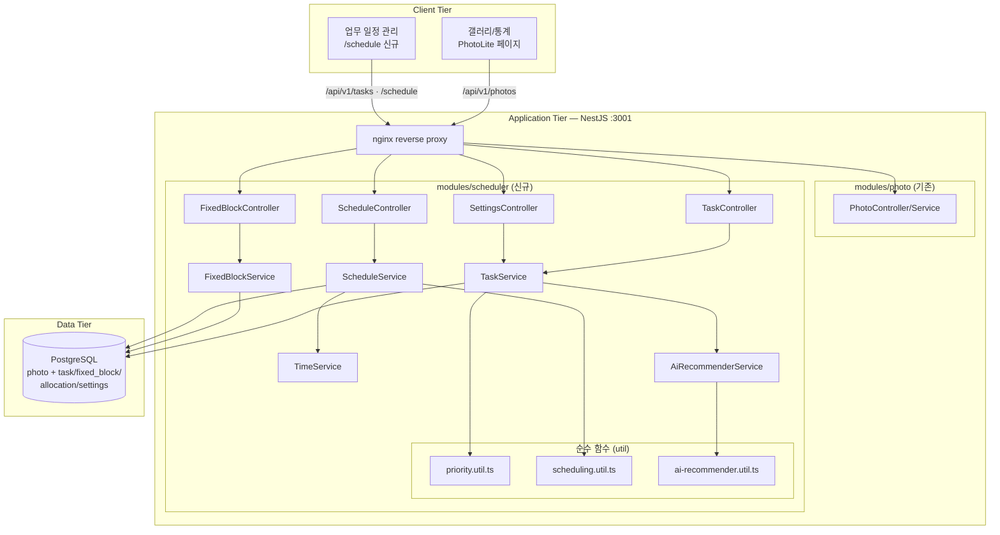
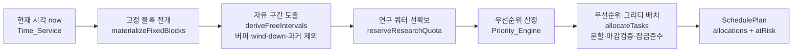
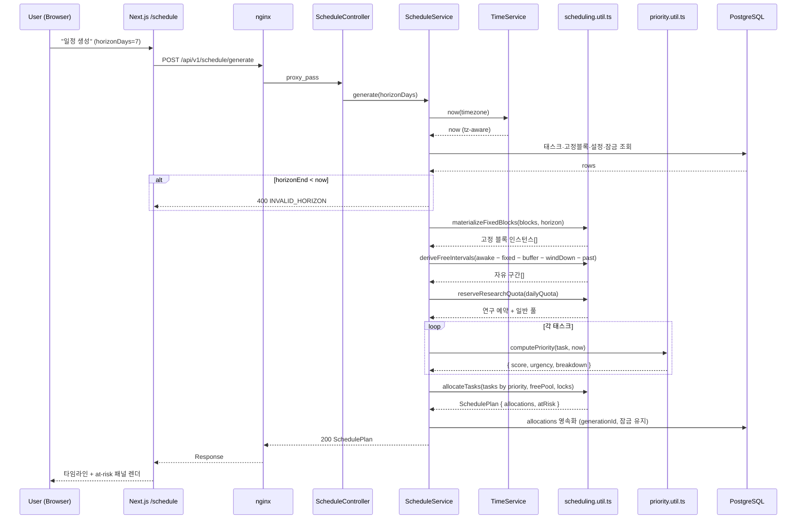

# Design Document: SmartScheduler

## Overview

SmartScheduler는 PhotoLite에 추가되는 업무 우선순위 자동 관리 기능이다. 필수 생활/연구 시간을 고정 블록으로 먼저 보호하고, 남은 자유 시간에 마감 기한과 중요도를 기준으로 유동 업무를 자동 분할·배치한다. 현재 시간 기준 남은 기한을 표시하고, 업무 성격에 맞는 AI 에이전트 프롬프트를 추천한다.

**핵심 기술 결정:**
- 우선순위 산정: `urgency = clamp(남은노력 / 마감까지_남은시간, 0, 2)`, `score = 0.6·urgency + 0.4·(importance/5)` (가중치 설정 가능)
- 일정 배치: 고정 블록 우선 배치 → 자유 구간 도출 → **연구 쿼터 선확보** → 우선순위 그리디(priority-greedy) 분할 배치, 마감 초과분은 at-risk로 보고
- 핵심 로직은 PhotoLite의 `image.util.ts`와 동일하게 **DI 없는 순수 함수 모듈**(`priority.util.ts`, `scheduling.util.ts`, `ai-recommender.util.ts`)로 구현하여 fast-check property test로 검증
- 시간 처리: 서버 시스템 클럭 + IANA 타임존(기본 `Asia/Seoul`), DST-안전한 타임존 연산
- AI 추천: 카테고리 기본 적합도 + 키워드 가감 → 임계값 분류 → 카테고리별 템플릿 프롬프트(결정적, 외부 호출 없음). LLM 강화 모드는 선택적 확장으로 명시
- 단일 사용자(single-tenant): 인증 없음, 설정은 단일 행. PhotoLite와 동일한 보안 미들웨어(helmet, CORS, throttler, ValidationPipe) 전역 재사용

**포트/접두사 구성:**
- Backend: 3001, API 접두사 `/api/v1` (PhotoLite와 공유)
- Frontend: 3000, 신규 페이지 `/schedule`

## Architecture

### 기존 시스템 통합 다이어그램



### 일정 생성 파이프라인



### 일정 생성 시퀀스 다이어그램



## Components and Interfaces

### 모듈 구조: `backend/src/modules/scheduler/`

```
backend/src/modules/scheduler/
├── scheduler.module.ts            # NestJS 모듈 정의 (엔티티 등록, 서비스 provider)
├── task.controller.ts             # 태스크 CRUD + 우선순위 + AI 추천 엔드포인트
├── fixed-block.controller.ts      # 고정 블록 CRUD 엔드포인트
├── schedule.controller.ts         # 일정 생성/조회/잠금 + 현재시간 엔드포인트
├── settings.controller.ts         # 스케줄러 설정 조회/수정
├── task.service.ts                # 태스크 비즈니스 로직 (CRUD, 진행률, overdue)
├── fixed-block.service.ts         # 고정 블록 CRUD, overnight wrap, 충돌 검증, 기본 시드
├── schedule.service.ts            # 일정 생성 오케스트레이션, allocation 영속화, 잠금
├── settings.service.ts            # 설정 단일 행 관리
├── time.service.ts                # 현재 시각, 남은 기한 계산·분류·포맷
├── ai-recommender.service.ts      # AI 적합도·프롬프트 생성 오케스트레이션
├── priority.util.ts               # 순수 함수: computePriority, effortDensity, comparePriority
├── scheduling.util.ts             # 순수 함수: materializeFixedBlocks, deriveFreeIntervals,
│                                  #            reserveResearchQuota, allocateTasks, generateSchedule
├── ai-recommender.util.ts         # 순수 함수: computeSuitability, buildPrompt
├── scheduler.constants.ts         # 모든 상수/기본값 (매직넘버 추출)
├── dto/
│   ├── create-task.dto.ts
│   ├── update-task.dto.ts
│   ├── create-fixed-block.dto.ts
│   ├── update-settings.dto.ts
│   ├── generate-schedule.dto.ts   # horizonDays 또는 시작/종료일
│   └── response.dto.ts            # TaskResponse, SchedulePlanResponse, PriorityBreakdown, AiRecommendation
├── entities/
│   ├── task.entity.ts
│   ├── fixed-block.entity.ts
│   ├── schedule-allocation.entity.ts
│   └── scheduler-settings.entity.ts
└── interfaces/
    ├── priority.interface.ts       # PriorityBreakdown
    ├── schedule.interface.ts       # TimeBlock, SchedulePlan, UnscheduledTask, FreeInterval
    ├── ai.interface.ts             # AiRecommendation
    └── index.ts                    # barrel export
```

### 상수 정의 (`scheduler.constants.ts`)

```typescript
/** 우선순위 가중치 (urgency, importance) — 합이 1이 되도록 권장 */
export const DEFAULT_URGENCY_WEIGHT = 0.6;
export const DEFAULT_IMPORTANCE_WEIGHT = 0.4;

/** urgency(effort density) 상한. 마감 초과/완료불가 태스크를 최상위로 올리되 유계로 유지 */
export const URGENCY_CAP = 2.0;

/** 중요도 범위 */
export const MIN_IMPORTANCE = 1;
export const MAX_IMPORTANCE = 5;

/** 매일 선확보되는 연구 쿼터 (분) */
export const DEFAULT_RESEARCH_QUOTA_MIN = 180; // 3h

/** 고정 블록·세션 사이 전환 버퍼 (분) */
export const DEFAULT_BUFFER_MIN = 10;

/** 취침 직전 작업 금지(wind-down) 구간 (분) */
export const DEFAULT_WIND_DOWN_MIN = 30;

/** 분할 시 최소 청크 / 최대 포커스 세션 (분) */
export const DEFAULT_MIN_CHUNK_MIN = 25;
export const DEFAULT_MAX_FOCUS_MIN = 120;

/** 남은 기한 분류 임계값 (시간) */
export const CRITICAL_HOURS = 24;
export const WARNING_HOURS = 72;

/** AI 추천 임계값 및 카테고리 기본 적합도 */
export const AI_SUITABILITY_THRESHOLD = 0.5;
export const CATEGORY_AI_BASE: Record<string, number> = {
  DOCUMENT: 0.9,
  PERSONAL_RESEARCH: 0.8,
  ASSIGNMENT: 0.7,
  STUDY: 0.6,
  CLASS_PREP: 0.5,
  EXAM: 0.5,
  OTHER: 0.4,
};

/** AI 적합도 키워드 가감 (소문자/한글 부분일치) */
export const AI_BOOST_KEYWORDS = ['요약', '번역', '초안', '작성', '정리', '리뷰', '분석', '코드', '디버그', 'draft', 'summary', 'review', 'code'];
export const AI_PENALTY_KEYWORDS = ['실험', '촬영', '대면', '미팅', '발표', '인터뷰', '설문', 'lab', 'meeting', 'present'];

/** 기본 타임존 */
export const DEFAULT_TIMEZONE = 'Asia/Seoul';
```

### 주요 인터페이스

```typescript
// interfaces/priority.interface.ts
export interface PriorityBreakdown {
  score: number;               // 최종 우선순위 점수
  urgency: number;             // 0 ~ URGENCY_CAP
  effortDensity: number;       // 남은노력 / 마감까지_남은시간 (clamp 전 원값)
  normalizedImportance: number;// importance / 5
  remainingMinutes: number;    // 남은 예상 소요시간
  minutesUntilDeadline: number;// 마감까지 남은 분 (음수면 overdue)
  overdue: boolean;
}

// interfaces/schedule.interface.ts
export type AllocationKind = 'FIXED' | 'TASK' | 'RESEARCH_RESERVED';

export interface TimeBlock {
  kind: AllocationKind;
  taskId?: string;             // kind === 'TASK'
  fixedBlockId?: string;       // kind === 'FIXED'
  title: string;
  start: string;               // ISO 8601 (tz-aware)
  end: string;
  locked: boolean;
}

export interface UnscheduledTask {
  taskId: string;
  title: string;
  unplacedMinutes: number;
  reason: 'DEADLINE_BEFORE_CAPACITY' | 'HORIZON_CAPACITY_EXHAUSTED';
  suggestion: string;          // 예: "마감 연장", "범위 축소", "horizon 확장"
}

export interface SchedulePlan {
  generatedAt: string;         // ISO 8601
  horizonStart: string;
  horizonEnd: string;
  allocations: TimeBlock[];    // start 오름차순
  atRisk: UnscheduledTask[];
  dayCapacityWarnings: Array<{ date: string; message: string }>;
}

// interfaces/ai.interface.ts
export interface AiRecommendation {
  taskId: string;
  recommended: boolean;
  suitabilityScore: number;    // 0.0 ~ 1.0
  useType?: string;            // 예: "문서 초안", "문헌 요약", "코드 작성/디버깅"
  prompt?: string;             // recommended === true 일 때 즉시 사용 가능한 프롬프트
  rationale: string;           // 추천/비추천 사유
}

// 태스크 응답 (남은 기한 + 우선순위 + AI 추천 합본)
interface TaskResponse {
  id: string;
  title: string;
  category: string;
  importance: number;
  deadline: string;
  estimatedMinutes: number;
  completedMinutes: number;
  status: 'PENDING' | 'IN_PROGRESS' | 'DONE' | 'ARCHIVED';
  remaining: { totalMinutes: number; days: number; hours: number; minutes: number;
               classification: 'OVERDUE' | 'CRITICAL' | 'WARNING' | 'NORMAL' };
  priority: PriorityBreakdown;
  ai: AiRecommendation;
}
```

### API 엔드포인트

| Method | Path | 설명 |
|--------|------|------|
| POST | `/api/v1/tasks` | 태스크 생성 |
| GET | `/api/v1/tasks` | 태스크 목록 (남은 기한·우선순위·AI 추천 포함, 우선순위 desc 정렬) |
| GET | `/api/v1/tasks/:id` | 태스크 상세 |
| PATCH | `/api/v1/tasks/:id` | 태스크 수정 (중요도/마감/진행률/상태) |
| DELETE | `/api/v1/tasks/:id` | 태스크 삭제 |
| GET | `/api/v1/tasks/:id/ai-recommendation` | 단일 태스크 AI 프롬프트 추천 |
| GET | `/api/v1/tasks/ai-recommendations` | 전체 태스크 AI 추천 배치 |
| POST | `/api/v1/fixed-blocks` | 고정 블록 생성 |
| GET | `/api/v1/fixed-blocks` | 고정 블록 목록 |
| PATCH | `/api/v1/fixed-blocks/:id` | 고정 블록 수정 |
| DELETE | `/api/v1/fixed-blocks/:id` | 고정 블록 삭제 |
| GET | `/api/v1/scheduler/settings` | 스케줄러 설정 조회 |
| PATCH | `/api/v1/scheduler/settings` | 스케줄러 설정 수정 |
| GET | `/api/v1/scheduler/now` | 서버 현재 시각 + 타임존 |
| POST | `/api/v1/schedule/generate` | 일정 생성/재생성 (horizon 지정) |
| GET | `/api/v1/schedule` | 일정 조회 (date range, allocations + atRisk) |
| POST | `/api/v1/schedule/allocations/:id/lock` | 배치 잠금(고정) |
| DELETE | `/api/v1/schedule/allocations/:id/lock` | 잠금 해제 |

### priority.util.ts — 우선순위 산정 (순수 함수)

```typescript
import {
  URGENCY_CAP, MAX_IMPORTANCE,
  DEFAULT_URGENCY_WEIGHT, DEFAULT_IMPORTANCE_WEIGHT,
} from './scheduler.constants';

const clamp = (v: number, lo: number, hi: number) => Math.max(lo, Math.min(hi, v));

/**
 * 우선순위 산정
 * - remainingMinutes = max(estimated - completed, 0)
 * - minutesUntilDeadline = (deadline - now) / 60000
 * - deadline 도래/경과 시: urgency = URGENCY_CAP, overdue = true
 * - 그 외: effortDensity = remaining / minutesUntilDeadline, urgency = clamp(effortDensity, 0, URGENCY_CAP)
 * - score = uW·urgency + iW·(importance/5)
 */
export function computePriority(
  task: { estimatedMinutes: number; completedMinutes: number; deadline: Date; importance: number },
  now: Date,
  weights = { urgency: DEFAULT_URGENCY_WEIGHT, importance: DEFAULT_IMPORTANCE_WEIGHT },
): PriorityBreakdown {
  const remainingMinutes = Math.max(task.estimatedMinutes - task.completedMinutes, 0);
  const minutesUntilDeadline = (task.deadline.getTime() - now.getTime()) / 60000;

  let urgency: number;
  let effortDensity: number;
  const overdue = minutesUntilDeadline <= 0;
  if (overdue) {
    effortDensity = Infinity;
    urgency = URGENCY_CAP;
  } else {
    effortDensity = remainingMinutes / minutesUntilDeadline;
    urgency = clamp(effortDensity, 0, URGENCY_CAP);
  }

  const normalizedImportance = task.importance / MAX_IMPORTANCE;
  const score = weights.urgency * urgency + weights.importance * normalizedImportance;

  return { score, urgency, effortDensity, normalizedImportance,
           remainingMinutes, minutesUntilDeadline, overdue };
}

/**
 * 동점 처리: score desc → deadline asc → importance desc → createdAt asc → id asc
 * @returns 음수면 a가 우선
 */
export function comparePriority(a, b): number {
  if (b.score !== a.score) return b.score - a.score;
  if (a.deadline.getTime() !== b.deadline.getTime()) return a.deadline.getTime() - b.deadline.getTime();
  if (b.importance !== a.importance) return b.importance - a.importance;
  if (a.createdAt.getTime() !== b.createdAt.getTime()) return a.createdAt.getTime() - b.createdAt.getTime();
  return a.id < b.id ? -1 : a.id > b.id ? 1 : 0;
}
```

### scheduling.util.ts — 일정 분할·배치 (순수 함수, 핵심)

배치 엔진은 외부 의존성 없는 결정적 순수 함수다. `now`를 명시적으로 주입받아 동일 입력에 동일 결과를 보장한다.

```typescript
/**
 * 1) 고정 블록 전개: horizon 내 각 날짜에 대해 recurring(weekday 매칭)·one-off(date 매칭) 고정 블록을
 *    타임존-aware한 구체 구간으로 전개. end <= start 인 블록은 익일로 넘어가는(overnight) 구간으로 처리.
 */
export function materializeFixedBlocks(blocks, horizon, tz): MaterializedBlock[];

/**
 * 2) 자유 구간 도출:
 *    - 각 날짜의 awake window = [기상(수면 종료), 취침(수면 시작)]
 *    - awake window 에서 meal/exercise/class/custom 고정 블록 제거
 *    - 각 고정 블록 경계에 buffer(분) 적용 → 인접 자유 구간 축소
 *    - 취침 시작 직전 windDown(분) 제거
 *    - now 이전(과거) 구간 제거
 *    - 길이가 minChunk 미만인 자투리 구간 제거
 */
export function deriveFreeIntervals(materialized, settings, now): FreeInterval[];

/**
 * 3) 연구 쿼터 선확보:
 *    - 각 날짜에서 dailyQuota(분)만큼을 가장 이른 자유 구간부터 연구용으로 예약
 *    - 자유 시간이 dailyQuota 미만이면 그 날의 남은 자유 시간 전체를 예약하고 shortfall 보고
 *    - 예약 구간은 PERSONAL_RESEARCH 태스크 전용 풀로, 나머지는 일반 풀로 분리
 * @returns { researchPool, generalPool, shortfalls }
 */
export function reserveResearchQuota(freeIntervals, dailyQuota): ReservedPools;

/**
 * 4) 우선순위 그리디 배치:
 *    - PERSONAL_RESEARCH 태스크: researchPool 우선 → 부족분은 generalPool
 *    - 그 외 태스크: generalPool
 *    - 풀의 구간을 시간순으로 순회하며, 매 슬롯마다 "배치 가능한 최고 우선순위 태스크"를 선택
 *      (eligible 조건: earliestStart <= slotStart AND deadline > slotStart AND remaining > 0)
 *    - 세션 길이 = min(remaining, maxFocus, slotRemaining, deadline까지 남은시간) (>= minChunk 또는 최종 자투리)
 *    - 세션 종료는 deadline 이내로 보장. 세션 후 같은 구간에 작업이 더 있으면 buffer 삽입
 *    - locked allocation 은 사전 점유로 취급하여 보존(겹치지 않게 배치)
 *    - 미배치 remaining 은 atRisk 로 사유와 함께 보고
 */
export function allocateTasks(tasks, pools, locks, settings, now): { allocations, atRisk };

/** 엔트리: 위 1~4 + 연구 예약/고정 블록을 합쳐 정렬된 SchedulePlan 반환 (결정적·멱등) */
export function generateSchedule(input: {
  tasks; fixedBlocks; settings; locks; horizonStart: Date; horizonEnd: Date; now: Date; tz: string;
}): SchedulePlan;
```

**배치 알고리즘 의사코드 (allocateTasks 핵심 루프):**

```text
for each interval in chronological(pools):          # 과거·고정·버퍼 제외된 구간만
    cursor = interval.start
    while cursor + minChunk <= interval.end:
        candidates = tasks where remaining(t) > 0
                       and t.earliestStart <= cursor
                       and t.deadline > cursor
        if candidates is empty: break
        t = max(candidates, key = priorityScore(t, now), tie = comparePriority)
        cap = min(remaining(t),
                  settings.maxFocus,
                  interval.end - cursor,
                  t.deadline - cursor)            # 마감 초과 금지
        session = max(cap, ...)                    # minChunk 보장(최종 자투리 예외)
        emit allocation(t, cursor, cursor + session)
        remaining(t) -= session
        cursor += session + settings.buffer
# 종료 후 remaining(t) > 0 인 태스크 → atRisk
#   사유: 마감 전 빈 슬롯이 없었으면 DEADLINE_BEFORE_CAPACITY, 아니면 HORIZON_CAPACITY_EXHAUSTED
```

### 설계 결정 사항

- **EDF가 아닌 priority-greedy 채택 이유**: 사용자는 "마감 기한과 중요도로 판단"을 원한다. urgency 항이 effort density(= remaining/time-to-deadline)이므로 마감이 다가올수록 점수가 가파르게 상승하여 자연스럽게 마감 임박 태스크가 선택된다. 동시에 importance 항으로 중요도가 반영된다. 용량 부족 시에는 우선순위가 낮은 태스크가 atRisk로 밀려나 보고된다.
- **연구 시간 보호**: `Protected_Research_Quota`를 일반 배치보다 먼저 차감하여 서류/긴급 업무가 연구 시간을 잠식하지 못하게 한다. 사용자가 명시한 "연구 시간 충분히 확보" 요구를 구조적으로 보장한다.
- **수면/식사/운동 불가침**: awake window 자체가 수면을 제외한 구간이고, 식사·운동은 고정 블록으로 자유 구간에서 제거되므로 어떤 태스크도 침범 불가하다.
- **결정성**: `now`·정렬 타이브레이크·정수 분 단위 연산으로 멱등성을 확보하여 property test 가능. 재생성 시 locked allocation을 사전 점유로 두어 보존한다.

## Data Models

### Task 테이블

| 컬럼 | 타입 | 제약조건 | 설명 |
|------|------|---------|------|
| id | UUID | PK, DEFAULT gen_random_uuid() | 고유 식별자 |
| title | VARCHAR(255) | NOT NULL | 업무 제목 |
| description | TEXT | NULL | 업무 설명 |
| category | VARCHAR(20) | NOT NULL | DOCUMENT/ASSIGNMENT/PERSONAL_RESEARCH/STUDY/CLASS_PREP/EXAM/OTHER |
| importance | SMALLINT | NOT NULL, CHECK 1..5 | 중요도 |
| deadline | TIMESTAMPTZ | NOT NULL, INDEX | 마감 기한 |
| estimatedMinutes | INTEGER | NOT NULL, CHECK > 0 | 예상 소요(분) |
| completedMinutes | INTEGER | NOT NULL, DEFAULT 0 | 완료(분) |
| earliestStart | TIMESTAMPTZ | NULL | 가장 이른 시작 시각 |
| status | VARCHAR(12) | NOT NULL, DEFAULT 'PENDING' | PENDING/IN_PROGRESS/DONE/ARCHIVED |
| createdAt | TIMESTAMPTZ | NOT NULL, DEFAULT NOW() | 생성 시각 |
| updatedAt | TIMESTAMPTZ | NOT NULL, DEFAULT NOW() | 수정 시각 |

### FixedBlock 테이블

| 컬럼 | 타입 | 제약조건 | 설명 |
|------|------|---------|------|
| id | UUID | PK | 고유 식별자 |
| type | VARCHAR(10) | NOT NULL | SLEEP/MEAL/EXERCISE/CLASS/CUSTOM |
| title | VARCHAR(255) | NOT NULL | 블록 제목 |
| startMinute | SMALLINT | NOT NULL, CHECK 0..1439 | 자정 기준 시작(분) |
| endMinute | SMALLINT | NOT NULL, CHECK 0..1440 | 자정 기준 종료(분), end<=start면 익일 |
| daysOfWeek | SMALLINT | NULL | 요일 비트마스크(0=일~6=토), recurring 시 사용 |
| specificDate | DATE | NULL | one-off 시 사용 (daysOfWeek와 배타) |
| isRecurring | BOOLEAN | NOT NULL | 반복 여부 |
| createdAt | TIMESTAMPTZ | NOT NULL, DEFAULT NOW() | 생성 시각 |

### ScheduleAllocation 테이블

| 컬럼 | 타입 | 제약조건 | 설명 |
|------|------|---------|------|
| id | UUID | PK | 고유 식별자 |
| generationId | UUID | NOT NULL, INDEX | 일정 생성 회차 식별자 |
| kind | VARCHAR(16) | NOT NULL | FIXED/TASK/RESEARCH_RESERVED |
| taskId | UUID | NULL, FK→task | kind=TASK |
| fixedBlockId | UUID | NULL, FK→fixed_block | kind=FIXED |
| startAt | TIMESTAMPTZ | NOT NULL, INDEX | 시작 시각 |
| endAt | TIMESTAMPTZ | NOT NULL | 종료 시각 |
| locked | BOOLEAN | NOT NULL, DEFAULT false | 사용자 잠금 여부 |
| createdAt | TIMESTAMPTZ | NOT NULL, DEFAULT NOW() | 생성 시각 |

### SchedulerSettings 테이블 (단일 행)

| 컬럼 | 타입 | 기본값 | 설명 |
|------|------|--------|------|
| id | UUID | gen_random_uuid() | PK |
| timezone | VARCHAR(40) | 'Asia/Seoul' | IANA 타임존 |
| researchQuotaMin | INTEGER | 180 | 일일 연구 쿼터(분) |
| bufferMin | INTEGER | 10 | 전환 버퍼(분) |
| windDownMin | INTEGER | 30 | 취침 전 작업 금지(분) |
| minChunkMin | INTEGER | 25 | 최소 청크(분) |
| maxFocusMin | INTEGER | 120 | 최대 포커스 세션(분) |
| urgencyWeight | NUMERIC(3,2) | 0.60 | urgency 가중치 |
| importanceWeight | NUMERIC(3,2) | 0.40 | importance 가중치 |
| aiThreshold | NUMERIC(3,2) | 0.50 | AI 추천 임계값 |
| updatedAt | TIMESTAMPTZ | NOW() | 수정 시각 |

### TypeORM Entity 정의 (Task 예시)

```typescript
@Entity('task')
@Index('idx_task_deadline', ['deadline'])
@Index('idx_task_status', ['status'])
export class Task {
  @PrimaryGeneratedColumn('uuid') id: string;
  @Column({ type: 'varchar', length: 255 }) title: string;
  @Column({ type: 'text', nullable: true }) description?: string;
  @Column({ type: 'varchar', length: 20 }) category: string;
  @Column({ type: 'smallint' }) importance: number;        // CHECK 1..5
  @Column({ type: 'timestamptz' }) deadline: Date;
  @Column({ type: 'integer' }) estimatedMinutes: number;   // CHECK > 0
  @Column({ type: 'integer', default: 0 }) completedMinutes: number;
  @Column({ type: 'timestamptz', nullable: true }) earliestStart?: Date;
  @Column({ type: 'varchar', length: 12, default: 'PENDING' }) status: string;
  @CreateDateColumn({ type: 'timestamptz' }) createdAt: Date;
  @UpdateDateColumn({ type: 'timestamptz' }) updatedAt: Date;
}
```

### DDL (요지)

```sql
CREATE TABLE task (
  id UUID PRIMARY KEY DEFAULT gen_random_uuid(),
  title VARCHAR(255) NOT NULL,
  description TEXT,
  category VARCHAR(20) NOT NULL,
  importance SMALLINT NOT NULL CHECK (importance BETWEEN 1 AND 5),
  deadline TIMESTAMPTZ NOT NULL,
  "estimatedMinutes" INTEGER NOT NULL CHECK ("estimatedMinutes" > 0),
  "completedMinutes" INTEGER NOT NULL DEFAULT 0,
  "earliestStart" TIMESTAMPTZ,
  status VARCHAR(12) NOT NULL DEFAULT 'PENDING',
  "createdAt" TIMESTAMPTZ NOT NULL DEFAULT NOW(),
  "updatedAt" TIMESTAMPTZ NOT NULL DEFAULT NOW()
);
CREATE INDEX idx_task_deadline ON task (deadline);
CREATE INDEX idx_task_status ON task (status);

CREATE TABLE fixed_block (
  id UUID PRIMARY KEY DEFAULT gen_random_uuid(),
  type VARCHAR(10) NOT NULL,
  title VARCHAR(255) NOT NULL,
  "startMinute" SMALLINT NOT NULL CHECK ("startMinute" BETWEEN 0 AND 1439),
  "endMinute" SMALLINT NOT NULL CHECK ("endMinute" BETWEEN 0 AND 1440),
  "daysOfWeek" SMALLINT,
  "specificDate" DATE,
  "isRecurring" BOOLEAN NOT NULL,
  "createdAt" TIMESTAMPTZ NOT NULL DEFAULT NOW()
);

CREATE TABLE schedule_allocation (
  id UUID PRIMARY KEY DEFAULT gen_random_uuid(),
  "generationId" UUID NOT NULL,
  kind VARCHAR(16) NOT NULL,
  "taskId" UUID REFERENCES task(id) ON DELETE CASCADE,
  "fixedBlockId" UUID REFERENCES fixed_block(id) ON DELETE SET NULL,
  "startAt" TIMESTAMPTZ NOT NULL,
  "endAt" TIMESTAMPTZ NOT NULL,
  locked BOOLEAN NOT NULL DEFAULT false,
  "createdAt" TIMESTAMPTZ NOT NULL DEFAULT NOW()
);
CREATE INDEX idx_alloc_generation ON schedule_allocation ("generationId");
CREATE INDEX idx_alloc_start ON schedule_allocation ("startAt");
```

## Correctness Properties

*A property is a characteristic or behavior that should hold true across all valid executions of a system—essentially, a formal statement about what the system should do. Properties serve as the bridge between human-readable specifications and machine-verifiable correctness guarantees.*

### Property 1: 고정 블록 불가침성

*For any* 고정 블록 집합과 horizon에 대해, `generateSchedule()`이 전개한 각 고정 블록 인스턴스는 출력 allocations에 시작/종료가 변경되지 않은 채로 포함되어야 하며, 어떤 TASK allocation도 고정 블록 인스턴스의 시간 구간과 겹치지 않아야 한다.

**Validates: Requirements 1.5, 4.1**

### Property 2: 수면 시간 및 필수 블록 보호

*For any* 입력에 대해, 어떤 TASK allocation도 SLEEP/MEAL/EXERCISE 고정 블록 구간 또는 취침 직전 wind-down 구간 안에 시작·종료·교차하지 않아야 한다.

**Validates: Requirements 5.3, 4.1**

### Property 3: 할당 비중첩

*For any* 생성된 일정에 대해, 정렬된 allocations에서 인접한 두 블록 `i, i+1`은 `end(i) <= start(i+1)`을 만족해야 하며(버퍼 적용 후), 어떤 두 allocation도 시간 구간이 겹치지 않아야 한다.

**Validates: Requirements 4.7**

### Property 4: 마감 준수 또는 보고

*For any* 태스크에 대해, 해당 태스크의 모든 세션은 `start < deadline` 이고 `end <= deadline` 이어야 한다(마감 초과 작업 없음). 그리고 남은 노력이 마감 전에 모두 배치되지 못하면, 미배치 분량이 atRisk 목록에 사유와 함께 보고되어야 한다(무단 누락 없음).

**Validates: Requirements 4.3, 4.5**

### Property 5: 노력량 보존

*For any* 태스크에 대해, (배치된 모든 세션 길이의 합) + (atRisk로 보고된 미배치 분량) == max(estimatedMinutes − completedMinutes, 0) 이어야 한다. 노력이 새로 만들어지거나 사라지지 않는다.

**Validates: Requirements 4.6**

### Property 6: 우선순위 점수 단조성

*For any* 두 태스크에 대해, 중요도가 같으면 effort density가 더 큰(= 마감 대비 노력이 더 빡빡한) 태스크의 priority score가 더 크거나 같아야 하고, urgency(clamp된 effort density)가 같으면 중요도가 높은 태스크의 score가 더 크거나 같아야 한다. 동일 입력·동일 `now`에 대해 score는 결정적이다.

**Validates: Requirements 3.2, 3.6**

### Property 7: 연구 시간 쿼터 확보

*For any* horizon의 어떤 날짜가 awake 자유 시간을 `researchQuotaMin` 이상 가지면, 그 날짜에 최소 `researchQuotaMin` 분이 연구(PERSONAL_RESEARCH 태스크 + 일반 연구 예약 블록)로 예약되어야 하며, 비-연구 태스크는 예약된 연구 분량을 소비하지 않아야 한다.

**Validates: Requirements 5.1, 5.2**

### Property 8: 포커스 세션 경계

*For any* TASK 세션에 대해, 세션 길이는 `maxFocusMin` 이하이고, `minChunkMin` 이상이어야 한다. 단, 한 태스크의 마지막 자투리(남은 노력 < minChunk)는 예외로 허용된다.

**Validates: Requirements 4.4**

### Property 9: 남은 기한 분류 정확성

*For any* 태스크 deadline과 현재 시각 `now`에 대해, remaining = deadline − now이고, 분류는 now >= deadline이면 OVERDUE, 0 < remaining <= 24h이면 CRITICAL, 24h < remaining <= 72h이면 WARNING, 그 외 NORMAL이어야 한다.

**Validates: Requirements 6.3**

### Property 10: AI 적합도 분류 및 프롬프트 일관성

*For any* 태스크에 대해, `recommended == (suitabilityScore >= aiThreshold)` 이고, suitabilityScore는 [0,1] 범위의 결정적 값이며, recommended가 true이면 생성된 prompt는 비어 있지 않고 태스크 제목을 포함해야 한다.

**Validates: Requirements 7.2, 7.3**

### Property 11: 결정성 및 멱등성

*For any* 고정된 입력(tasks, fixedBlocks, settings, locks, now, tz)에 대해, `generateSchedule()`은 결정적이어야 하며(두 번 호출 시 동일 출력), 입력 변경 없이 재생성하면 locked allocation이 그대로 보존된 동일 계획을 산출해야 한다.

**Validates: Requirements 4.8**

### Property 12: 잠금 보존

*For any* locked allocation 집합과 입력에 대해, 재생성된 일정은 모든 locked allocation을 시간 변경 없이 포함해야 하며, 다른 어떤 TASK allocation도 locked 구간과 겹치지 않아야 한다.

**Validates: Requirements 8.2**

## Error Handling

### 에러 처리 전략

| 에러 유형 | HTTP 상태 | 응답 형식 | 동작 |
|-----------|----------|-----------|------|
| 태스크 검증 실패(중요도/노력/마감) | 400 | `{ error: "VALIDATION_FAILED", message, details }` | - |
| 고정 블록 시간 충돌 | 409 | `{ error: "FIXED_BLOCK_CONFLICT", message, details: { conflictId } }` | - |
| horizon 종료 < 현재시각 | 400 | `{ error: "INVALID_HORIZON", message }` | - |
| 잠금/배치 대상 없음 | 404 | `{ error: "ALLOCATION_NOT_FOUND", message }` | - |
| 용량 초과(미배치 태스크 존재) | 200 (일정 반환) | 응답 `atRisk[]`에 사유·remedy 포함 | 가능한 만큼 배치 |
| 날짜 자유시간 없음 | 200 (일정 반환) | 응답 `dayCapacityWarnings[]` 포함 | 해당일 태스크 미배치 |
| 연구 쿼터 > 자유시간 | 200 (일정 반환) | `dayCapacityWarnings[]`에 shortfall 보고 | 자유시간 전체를 연구로 예약 |
| 현재시각 소스 실패 | 200 | 응답에 `usedFallbackClock: true` 플래그 | 서버 시스템 클럭으로 폴백 |
| DB 연결 실패 | 503 | `{ error: "SERVICE_UNAVAILABLE", message }` | 부분 결과 미저장 |
| Rate Limit 초과 | 429 | `{ error: "TOO_MANY_REQUESTS", message }` | @nestjs/throttler 자동 |

### 에러 응답 공통 구조

```typescript
interface ErrorResponse {
  error: string;        // 대문자 스네이크케이스 코드
  message: string;      // 사용자 친화적 메시지
  details?: Record<string, any>;
  timestamp: string;    // ISO 8601
}
```

## Testing Strategy

### 이중 테스트 접근법

**1. Property-Based Tests (fast-check)**

- 라이브러리: `fast-check`, 최소 100회 반복 실행
- 순수 함수(`priority.util.ts`, `scheduling.util.ts`, `ai-recommender.util.ts`, `time.service`의 순수 헬퍼)를 직접 테스트
- 각 테스트에 Property 참조 태그 포함

| Property | 테스트 대상 | Generator 전략 |
|----------|------------|----------------|
| Property 1 | 고정 블록 불가침/비교차 | 랜덤 고정 블록 + horizon |
| Property 2 | 수면/필수 블록 보호 | 랜덤 고정 블록(수면 포함) + 태스크 |
| Property 3 | 할당 비중첩 | 랜덤 태스크/블록 → generateSchedule |
| Property 4 | 마감 준수/atRisk 보고 | 랜덤 마감·노력 조합(과밀 포함) |
| Property 5 | 노력량 보존 | 랜덤 태스크 배열 |
| Property 6 | 우선순위 단조성 | 랜덤 (importance, deadline, effort) 쌍 |
| Property 7 | 연구 쿼터 확보 | 랜덤 자유시간 + 연구/비연구 태스크 |
| Property 8 | 포커스 세션 경계 | 랜덤 노력량·구간 길이 |
| Property 9 | 남은 기한 분류 | 랜덤 deadline 오프셋(과거~미래) |
| Property 10 | AI 적합도/프롬프트 | 랜덤 카테고리 + 키워드 문자열 |
| Property 11 | 결정성/멱등성 | 동일 입력 2회 호출 비교 |
| Property 12 | 잠금 보존 | 랜덤 locked allocation + 재생성 |

**태그 형식:**
```typescript
// Feature: smart-scheduler, Property 4: 마감 준수 또는 보고
// Feature: smart-scheduler, Property 7: 연구 시간 쿼터 확보
```

**2. Unit Tests (Jest)**

- 정상 케이스(예: 하루치 태스크 3개 정상 배치), 엣지(태스크 0개, 과밀, 자유시간 0)
- 고정 블록 overnight wrap·충돌 검증
- 남은 기한 경계값(24h/72h 정확히)
- AI 추천 임계값 경계, 카테고리별 프롬프트 생성

**3. Integration Tests**

- 전체 일정 생성 플로우(태스크/블록/설정 → generate → allocations + atRisk)
- 잠금 후 재생성 보존
- 성능 벤치마크(통계성 대량 태스크에서 생성 시간)
- 보안 헤더(helmet, CORS, throttler) 검증

### 테스트 구조

```
backend/src/modules/scheduler/
├── __tests__/
│   ├── task.controller.spec.ts
│   ├── schedule.service.spec.ts
│   ├── time.service.spec.ts
│   ├── properties/
│   │   ├── priority.prop.ts        # Property 6, 11(부분)
│   │   ├── scheduling.prop.ts      # Property 1, 2, 3, 4, 5, 7, 8, 11, 12
│   │   ├── time.prop.ts            # Property 9
│   │   └── ai.prop.ts              # Property 10
│   └── integration/
│       ├── schedule-flow.e2e.ts
│       └── performance.bench.ts
```

### Property Test 설정 예시

```typescript
import fc from 'fast-check';
import { generateSchedule } from '../scheduling.util';

// Feature: smart-scheduler, Property 5: 노력량 보존
describe('Scheduling Properties', () => {
  it('preserves total effort (scheduled + at-risk == remaining)', () => {
    fc.assert(
      fc.property(arbInput(), (input) => {
        const plan = generateSchedule(input);
        for (const task of input.tasks) {
          const scheduled = plan.allocations
            .filter((a) => a.taskId === task.id)
            .reduce((s, a) => s + minutesBetween(a.start, a.end), 0);
          const atRisk = plan.atRisk
            .filter((u) => u.taskId === task.id)
            .reduce((s, u) => s + u.unplacedMinutes, 0);
          const remaining = Math.max(task.estimatedMinutes - task.completedMinutes, 0);
          expect(scheduled + atRisk).toBe(remaining);
        }
      }),
      { numRuns: 100 },
    );
  });
});
```
